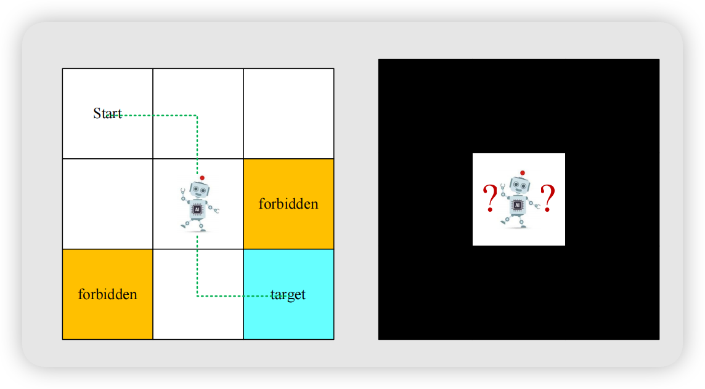
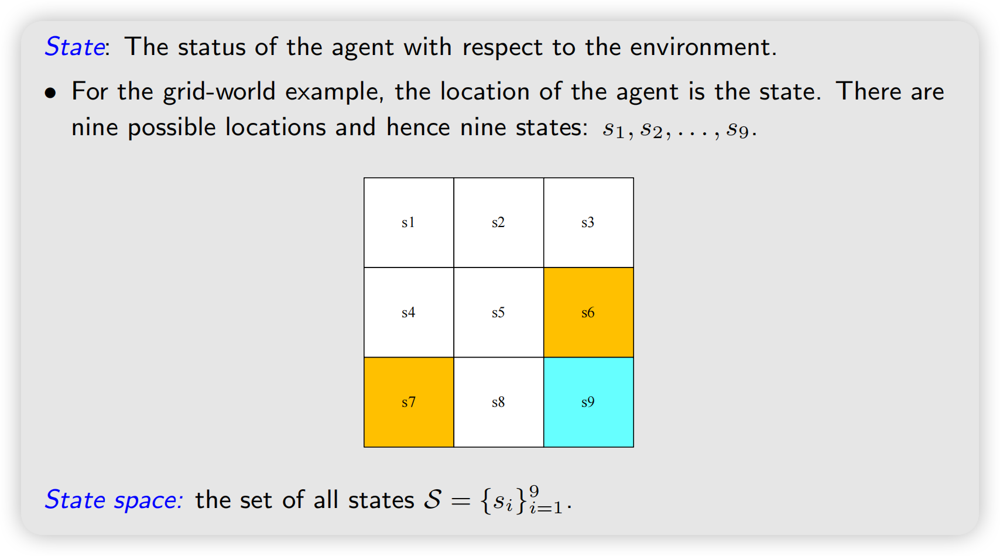
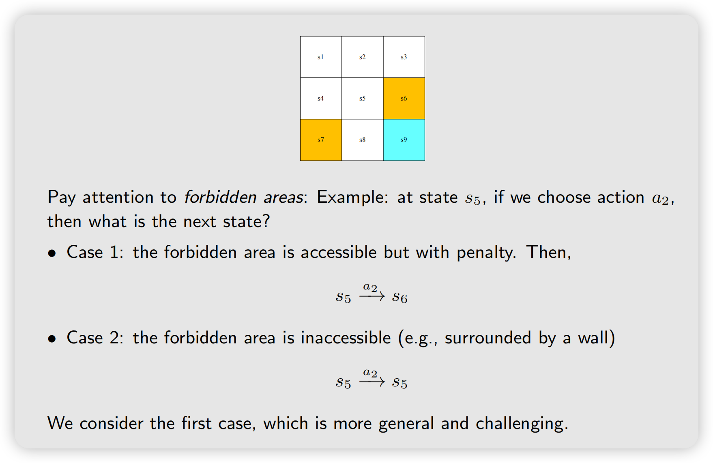
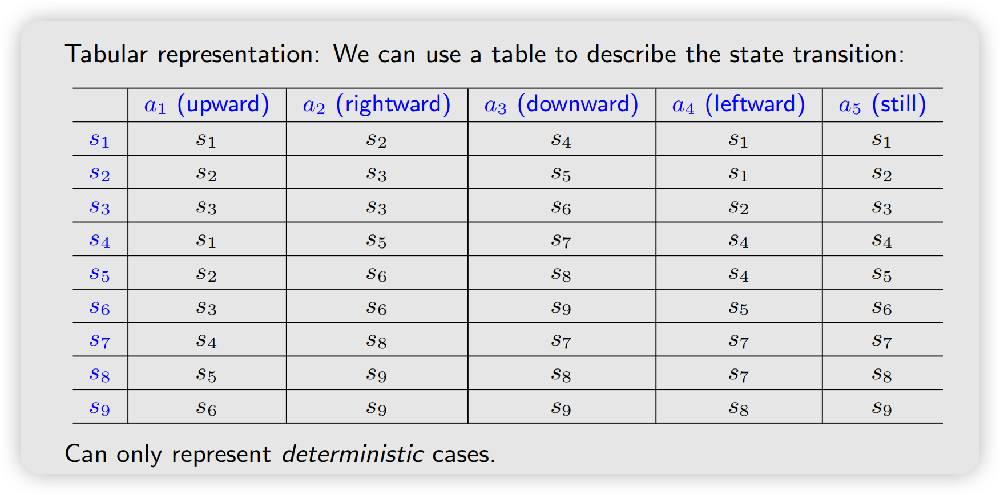
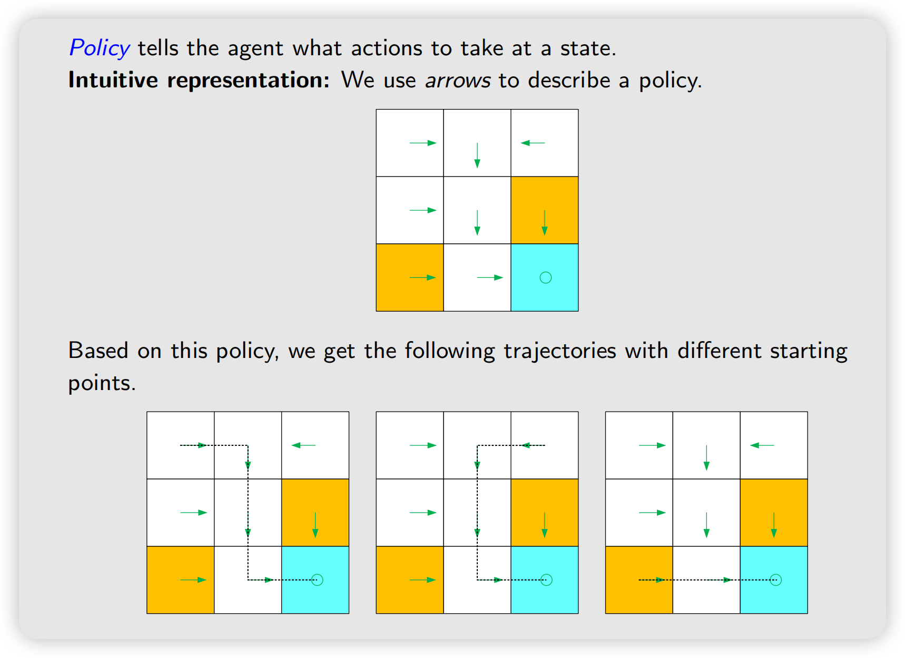
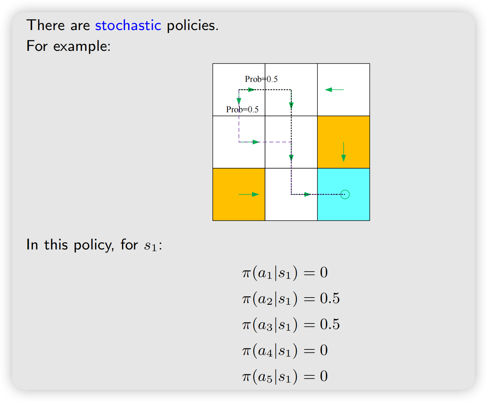
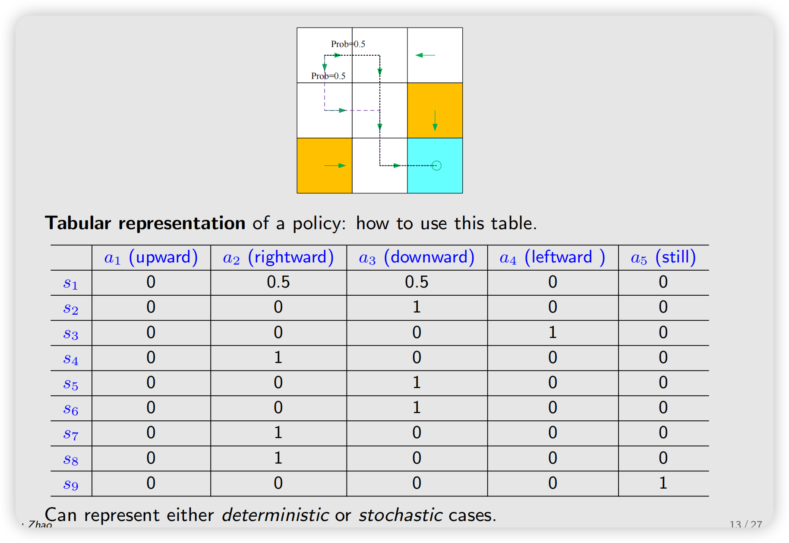
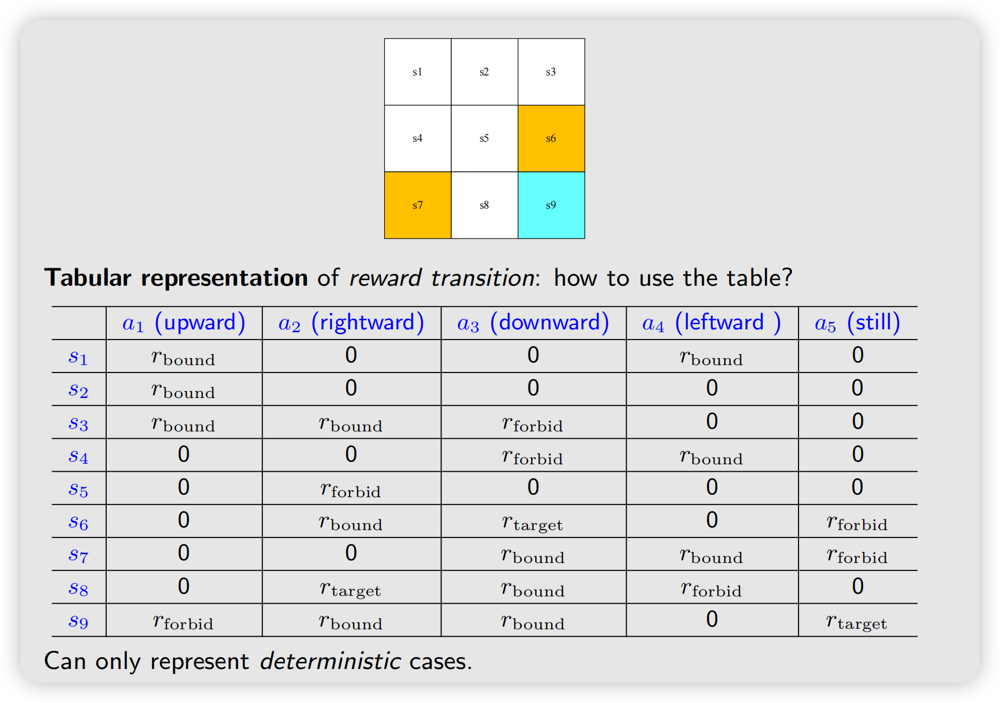
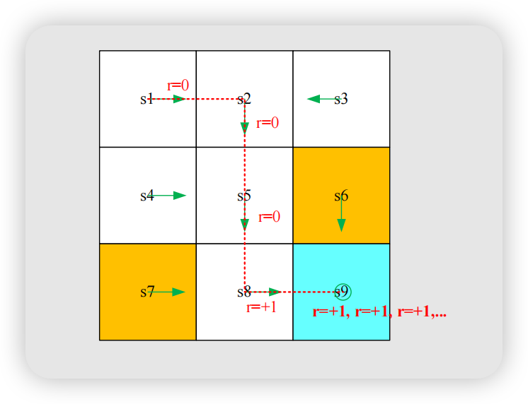

## A grid-world example

一个网格世界，非常经典的例子
{width=650}

机器人可以到达相邻的网格，不能进入forbidden的网格，且网格四周有边界
- 任务：找到一个比较好的路径从起点到终点

## State

在网格世界中，state就是agent的位置。比如下图中有9个状态：$s_1, ..., s_9$

:::note[State space 状态空间]
所有状态的集合，$\mathcal S$
:::

## Action

对于每个状态，Agent可采取的行动叫做Action。例如：
- $a_1$: move upward;
- $a_2$: move rightward;
- $a_3$: move downward;
- $a_4$: move leftward.
- ...

:::note[Action space 动作空间]
所有可能行动的集合，$\mathcal A(s_i)$ , 注意，因为Action是依赖于State的，所以$\mathcal A$是$s_i$的函数
:::

### State transition 状态转移

当agent采取一个action的时候，状态会从一个转移到另一个，这种过程叫做状态转移， 用如下符号表示：
$$
s_1 \xrightarrow{a_1} s_2
$$
其中
- $s_1, s_2 \in \mathcal{S}$
- $a_1 \in \mathcal{A}(s_1)$

State transition定义了Agent和环境交互的规则。比如以下例子：

本课程采用case1

#### 用表格表示state transition

第$i$行第$j$列表示$s_i \xrightarrow{a_j} s_k$

局限性：只能表示确定性的情况

#### State transition probability

用概率（条件概率）去表示state transition

- Intuition 直觉：At state s1, if we choose action a2, the next state is s2
- 数学表示：
$$
p(s_2 \mid s_1,a_2) = 1 \\
p(s_i \mid s_1,a_2) = 0, \forall i \not = 2 \\
$$

## Policy

策略告诉Agent在某个状态下采取什么动作

### 用箭头表示

### 数学表示

也是采用条件概率表示，比如在$s_1$:

$$
\pi(a_1 \mid s_1) = 0 \\
\pi(a_2 \mid s_1) = 1 \\
\pi(a_3 \mid s_1) = 0 \\
\pi(a_4 \mid s_1) = 0 \\
\pi(a_5 \mid s_1) = 0 \\
$$

也有随机的（stochastic）策略

#### 用表格表示
第$i$行第$j$列表示$s_i$的状态下，采取动作$a_j$的概率，即$\pi(s_i \mid a_j)$的数值

## Reward

Reward是一个实数标量
- A positive reward represents encouragement to take such actions.
- A negative reward represents punishment to take such actions

比如说，在之前的网格世界，agent想要走出边界，那么我们可以让$r_{bound} = -1$

:::tip[reward]
Reward可以看作是人类和机器交互的一种手段，human-machine-interface, 我们通过设计reward告诉agent应该怎么做、不应该怎么做
:::

同样的，可以用表格表示reward

也可以用数学表示，例如：
$p(r=-1 \mid s_1,a_1) = 1$ and $p(r \not = 1 \mid s_1,a_1) = 0$

## Trajectory and return

轨迹是一个 state-action-reward 链

$$
s_1 \xrightarrow[r_1]{a_1} s_2 \xrightarrow[r_2]{a_2} \dots \xrightarrow[r_T]{a_T} s_{T+1}
$$

return是轨迹中所有reward的和，数学上可以用return刻画一个策略的好坏

### Discounted return 折扣汇报

为什么需要这么一个东西呢，看以下这种情况，一个轨迹：
$$
s_1 \xrightarrow{a_2} s_2 \xrightarrow{a_3} s_8 \xrightarrow{a_2} s_9 \xrightarrow{a_5} s_9 \dots
$$

此时return发散：
$$
return = 0 + 0 + 0 + 1 + 1 + 1 = \dots
$$

{width=60%}

由此定义discount rate 折扣因子 $\gamma \in (0,1)$，则discount return 定义为：

$$
\begin{aligned}
\text{discount return} &= 0 + \gamma 0 + \gamma^2 0 + \gamma^3 1 + \gamma^4 1 + \gamma^5 1 + \dots \\
& = \gamma^3 + \gamma^4 + \gamma^5 + \dots \\
& = \frac{\gamma^3}{1-\gamma}
\end{aligned}
$$

折扣汇报的作用：
- 让无限回报成为有限值
- 平衡近期奖励与远期奖励

当 $\gamma$ 接近 0 时：
$$
\gamma^k\rightarrow0
$$
智能体主要关心马上获得的奖励，表现得比较“短视”。
当  $\gamma$ 接近 1 时，远期奖励衰减得比较慢，智能体更愿意为了将来的较大收益暂时放弃当前收益。
