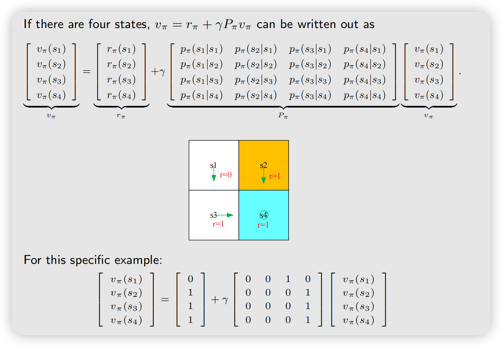
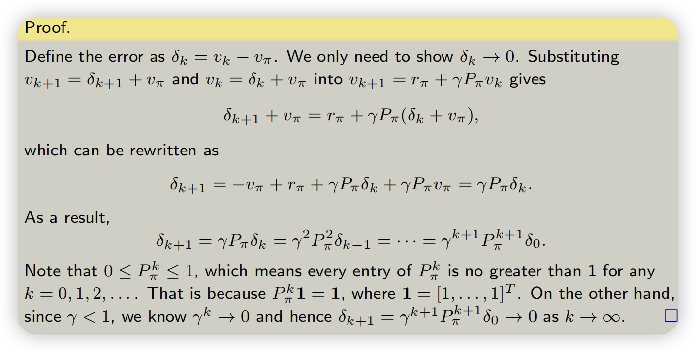

## Calculating return

给定这么一个例子和策略
{width=50%}

### Method 1: by definition

Let $v_i$ denote the return obtained starting from $s_i$ ($i = 1, 2, 3, 4$)

$$
\begin{aligned}
v_1 &= r_1 + \gamma r_2 + \gamma^2 r_3 + \dots \\
v_2 &= r_2 + \gamma r_3 + \gamma^2 r_4 + \dots \\
v_3 &= r_3 + \gamma r_4 + \gamma^2 r_1 + \dots \\
v_4 &= r_4 + \gamma r_1 + \gamma^2 r_2 + \dots
\end{aligned}
$$

### Method 2:

$$
\begin{aligned}
v_1 &= r_1 + \gamma(r_2 + \gamma r_3 + \dots) = r_1 + \gamma v_2 \\
v_2 &= r_2 + \gamma(r_3 + \gamma r_4 + \dots) = r_2 + \gamma v_3 \\
v_3 &= r_3 + \gamma(r_4 + \gamma r_1 + \dots) = r_3 + \gamma v_4 \\
v_4 &= r_4 + \gamma(r_1 + \gamma r_2 + \dots) = r_4 + \gamma v_1
\end{aligned}
$$

- The returns rely on each other. *Bootstrapping!* 相互依赖的。

:::note[Bootstrapping]

这种“用一个已有估计去更新另一个估计”就叫做 Bootstrapping。
这也是 TD learning、Q-learning、SARSA 等方法背后的核心思想。

:::

How to solve these equations? Write in the following matrix-vector form:

$$
\underbrace{
\begin{bmatrix} v_1 \\ v_2 \\ v_3 \\ v_4 \end{bmatrix}
}_{\mathbf{v}}
=
\begin{bmatrix} r_1 \\ r_2 \\ r_3 \\ r_4 \end{bmatrix}
+
\begin{bmatrix} \gamma v_2 \\ \gamma v_3 \\ \gamma v_4 \\ \gamma v_1 \end{bmatrix}
=
\underbrace{
\begin{bmatrix} r_1 \\ r_2 \\ r_3 \\ r_4 \end{bmatrix}
}_{\mathbf{r}}
+ \gamma
\underbrace{
\begin{bmatrix}
0 & 1 & 0 & 0 \\
0 & 0 & 1 & 0 \\
0 & 0 & 0 & 1 \\
1 & 0 & 0 & 0
\end{bmatrix}
}_{\mathbf{P}}
\underbrace{
\begin{bmatrix} v_1 \\ v_2 \\ v_3 \\ v_4 \end{bmatrix}
}_{\mathbf{v}}
$$

which can be rewritten as

$$
\mathbf{v} = \mathbf{r} + \gamma \mathbf{P} \mathbf{v}
$$

此处$\mathbf P$叫做状态转移矩阵

接下去移项求逆：
因此：
$$
\boxed{
\mathbf v
=
(I-\gamma P)^{-1}\mathbf r
}
$$
这就是直接求解 state value 的方法。

:::tip[]
这是这个特定的确定性问题下的 Bellman 方程。它展示了 Bellman 方程最核心的思想：一个状态的价值依赖于其他状态的价值。
:::

## State Value

### Notations
Consider the following single-step process:

$$
S_t \xrightarrow{A_t} R_{t+1}, S_{t+1}
$$

- $t, t + 1$: discrete time instances
- $S_t$: state at time $t$
- $A_t$: the action taken in state $S_t$
- $R_{t+1}$: the reward obtained after taking $A_t$，有时候也写作$R_t$
- $S_{t+1}$: the state transited to after taking $A_t$

Note that $S_t, A_t, R_{t+1}$ are all *random variables*. 随机变量，意思就是可以进行求期望等操作

This step is governed by （由...决定）the following probability distributions:

- $S_t \to A_t$ is governed by $\pi(A_t = a \mid S_t = s)$
- $S_t, A_t \to R_{t+1}$ is governed by $p(R_{t+1} = r \mid S_t = s, A_t = a)$
- $S_t, A_t \to S_{t+1}$ is governed by $p(S_{t+1} = s' \mid S_t = s, A_t = a)$

At this moment, we assume we know the model (i.e., the probability distributions)!

### Discounted return

Consider the following multi-step trajectory:

$$
S_t \xrightarrow{A_t} R_{t+1}, S_{t+1} \xrightarrow{A_{t+1}} R_{t+2}, S_{t+2} \xrightarrow{A_{t+2}} R_{t+3}, \dots
$$

The discounted return is

$$
G_t = R_{t+1} + \gamma R_{t+2} + \gamma^2 R_{t+3} + \dots
$$

- $\gamma \in (0, 1)$ is a discount rate.
- $G_t$ is also a random variable since $R_{t+1}, R_{t+2}, \dots$ are random variables.

### State Value

$G_t$的均值定义为state value或者state-value function
$$
v_{\pi}(s) = \mathbb E [G_t \mid S_t = s]
$$

它由$s,\pi$决定，因此也可以写作$v(\pi,s)$

:::note[Q: What is the relationship between return and state value?]

**A:** The state value is the mean of all possible returns that can be obtained starting from a state. If everything - $\pi(a|s), p(r|s, a), p(s'|s, a)$ - is deterministic（确定的，没有随机性）, then state value is the same as return.

:::

## Bellman equation 贝尔曼公式

贝尔曼公式描述了不同state value之间的关系，接下去，我们来推导（derive）贝尔曼公式

还是考虑这么一个轨迹：

$$
S_t \xrightarrow{A_t} R_{t+1}, S_{t+1} \xrightarrow{A_{t+1}} R_{t+2}, S_{t+2} \xrightarrow{A_{t+2}} R_{t+3}, \dots
$$

根据discounted return的定义，我们可以将$G_t$写为：

$$
\begin{aligned}
G_t &= R_{t+1} + \gamma R_{t+2} + \gamma^2 R_{t+3} + \dots \\
& = R_{t+1} + \gamma (R_{t+2} + \gamma R_{t+3} + \dots) \\
&= R_{t+1} + \gamma G_{t+1}
\end{aligned}

$$

根据state value的定义：

$$
v_{\pi}(s) = \mathbb E[G_t \mid S_t = s] = \mathbb E[R_{t+1} + \gamma G_{t+1} \mid S_t = s] \\
= \mathbb E[R_{t+1} \mid S_t = s] + \gamma \mathbb E[ G_{t+1} \mid S_t = s]
$$

接下来分别计算这两个期望，

我们知道$R_{t+1}$和$S_{t+1}$由$S_t$和$A_t$决定，因此：

$$
\mathbb E[R_{t+1} \mid S_t = s] = \sum_{a} \pi(a|s) \mathbb E[R_{t+1} \mid S_t = s, A_t = a] \\
= \sum_{a} \pi(a|s) \sum_{r} r p(r | s, a)
$$

This is the mean of immediate rewards

:::note[全期望公式]
普通的全期望公式是：
$$
\mathbb E[X]
=
\sum_y P(Y=y)\,\mathbb E[X\mid Y=y]
$$
意思是：先算不同 $Y=y$ 情况下 $X$ 的平均值，再按照每种 $Y=y$ 出现的概率加权平均。

这里用的是条件全期望公式：
$$
\mathbb E[X\mid Z]
=
\sum_y
P(Y=y\mid Z)
\mathbb E[X\mid Y=y,Z]
$$
:::

计算$\mathbb E[G_{t+1} \mid S_t = s]$:

$$
\begin{aligned}
\mathbb E[G_{t+1} \mid S_t = s] &= \sum_{s'} \mathbb E[G_{t+1} \mid S_t=s, S_{t+1} = s']p(s' \mid s) \quad 全期望公式，设下一步状态s' \\
&= \sum_{s'} \mathbb E[G_{t+1} \mid S_{t+1} = s'] p(s' \mid s) \quad \text{Markov process is memoryless }\\
&= \sum_{s'} v_{\pi}(s') p(s' \mid s) \quad \text{definition of state value }\\
&= \sum_{s'} v_{\pi}(s') \sum_{a} p(s' \mid s,a) \pi(a \mid s) \\

\end{aligned}
$$

This is the mean of future rewards

:::note[p(s'|s,a)]
在一般的 MDP 里，即使已经确定了当前 state $s$ 和 action $a$，下一状态 $s'$ 仍然完全可能是不确定的。这正是 $p(s'\mid s,a)$ 存在的原因。

比如你现在处于 $s$，采取动作“向右” $a$，但环境可能有随机性：
$$
p(s_1'\mid s,a)=0.8,\qquad p(s_2'\mid s,a)=0.2
$$
也就是：我已经确定要向右了，但环境可能有 20% 的概率让我滑到另一个位置
:::

Therefore, we have

$$
\begin{aligned}
{\color{red}v_{\pi}(s)} &= \mathbb{E}[R_{t+1}|S_t = s] + \gamma \mathbb{E}[G_{t+1}|S_t = s], \\
&= {\color{blue}\underbrace{ {\color{blue}\sum_{a}\pi(a|s)\sum_{r}p(r|s,a)}{\color{black}r} }_{\text{mean of immediate rewards}}} + \gamma {\color{blue}\underbrace{ {\color{blue}\sum_{a}\pi(a|s)\sum_{s'}p(s'|s,a)}{\color{red}v_{\pi}(s')} }_{\text{mean of future rewards}}}, \\
&= {\color{blue}\sum_{a}\pi(a|s)} {\color{blue}\left[ {\color{blue}\sum_{r}p(r|s,a)}{\color{black}r} + \gamma {\color{blue}\sum_{s'}p(s'|s,a)}{\color{red}v_{\pi}(s')} \right]}, \quad \forall s \in \mathcal{S}.
\end{aligned}
$$

Highlights:

- The above equation is called the *Bellman equation*, which characterizes the relationship among the state-value functions of different states.
- It consists of two terms: the *immediate reward term* and the *future reward term*.
- A set of equations: every state has an equation like this!!!

可以先把里面的变量分成三组：
$$
\underbrace{v_\pi(s),v_\pi(s')}_{\text{要求的}}
,\qquad
\underbrace{\pi(a|s)}_{\text{给定的策略}}
,\qquad
\underbrace{p(r|s,a),p(s'|s,a)}_{\text{环境模型}}
$$
- $v_\pi(s)$ 和 $v_\pi(s')$ 是要计算的，他们是相互依赖的
- 这里$\pi$是给定的策略，不是找最好的策略，而求解这个方程的过程就是给定一个$\pi$,去求解$v_{\pi}$ ，这个过程叫策略评估policy evaluation
- $p(r|s,a)$ 和 $p(s'|s,a)$ 是 Dynamic Model, 主要有两部分
  - reward model $p(r \mid s, a)$
  - transition model $p(s' \mid s, a)$

## Matrix-vector form of the Bellman equation

上一节得出的贝尔曼公式是element-wise的，它对于每一个state $s \in \mathcal S$均成立，意味着一共有$|\mathcal S|$个这样的公式，我们用向量和矩阵来表示他们。

Recall that:

$$
v_{\pi}(s) = \sum_{a} \pi(a|s) \left[ \sum_{r} p(r|s, a) r + \gamma \sum_{s'} p(s'|s, a) v_{\pi}(s') \right]
$$

Rewrite the Bellman equation as

$$
v_{\pi}(s) = r_{\pi}(s) + \gamma \sum_{s'} p_{\pi}(s'|s) v_{\pi}(s') \tag{1}
$$

where

$$
r_{\pi}(s) \triangleq \sum_{a} \pi(a|s) \sum_{r} p(r|s, a) r, \qquad p_{\pi}(s'|s) \triangleq \sum_{a} \pi(a|s) p(s'|s, a)
$$

其实$r_{\pi}(s)$就是$ \mathbb E[R_{t+1} \mid S_t = s]$ 就是即时Reward的均值，$p_{\pi}(s'|s)$为当前状态为$s$转移到$s'$的概率

设状态$s_1,s_2,...s_n$，对于状态$s_i$ :

$$
v_{\pi}(s_i) = r_{\pi}(s_i) + \gamma \sum_{s_j} p_{\pi}(s_j \mid s_i) v_{\pi}(s_j)
$$

写成矩阵形式：
$$
v_{\pi} = r_{\pi} + \gamma P_{\pi} v_{\pi}
$$

where

- $v_{\pi} = [v_{\pi}(s_1), \dots, v_{\pi}(s_n)]^T \in \mathbb{R}^n$
- $r_{\pi} = [r_{\pi}(s_1), \dots, r_{\pi}(s_n)]^T \in \mathbb{R}^n$
- $P_{\pi} \in \mathbb{R}^{n \times n}$, where $[P_{\pi}]_{ij} = p_{\pi}(s_j|s_i)$, is the *state transition matrix*

这个$[P_{\pi}]_{ij} = p_{\pi}(s_j|s_i)$这么定义也是因为贝尔曼方程左边$s_i$是出发状态，右边$s_j$枚举到达状态

举个例子：

## Solve state value

Given a policy, finding out the corresponding state values is called policy
evaluation!

贝尔曼方程：
$$
v_{\pi} = r_{\pi} + \gamma P_{\pi} v_{\pi}
$$

移项求逆：
$$
v_{\pi} = (I - \gamma P_{\pi})^{-1} r_{\pi}
$$

但是矩阵求逆可能很贵, 下面给出迭代法：

定义
$$
\mathbf v_k = \text{第 }k\text{ 次迭代时，对真实 }\mathbf v_\pi\text{ 的估计}
$$
令
$$
v_{k+1} = r_{\pi} + \gamma P_{\pi} v_{k}
$$
先随便猜一个 value vector $v_0$, 然后按照上述递推式更新即可，可以证明：

$$
\lim_{k\rightarrow\infty} v_k = v_{\pi} = (I - \gamma P_{\pi})^{-1} r_{\pi}
$$

## Action Value

From state value to action value:
- State value: the average return the agent can get starting from a state.
- Action value: the average return the agent can get starting from a state and
taking an action

定义Action Value：

$$
q_{\pi} (s,a) = \mathbb E[G_t \mid S_t=s, A_t=a]
$$

- $q_{\pi} (s,a)$ 是关于$(s,a)$的函数，并且以来与$\pi$

由全期望公式：

$$
\underbrace{\mathbb{E}[G_t \mid S_t = s]}_{v_{\pi}(s)} = \sum_{a} \underbrace{\mathbb{E}[G_t \mid S_t = s, A_t = a]}_{q_{\pi}(s,a)} \pi(a|s)
$$

Hence,

$$
{\color{red}v_{\pi}(s)} = \sum_{a} \pi(a|s) {\color{red}q_{\pi}(s,a)} \tag{2}
$$

再看贝尔曼公式

$$
v_{\pi}(s) = \sum_{a} \pi(a|s) \underbrace{\left[ \sum_{r} p(r|s, a) r + \gamma \sum_{s'} p(s'|s, a) v_{\pi}(s') \right]}_{{\color{red}q_{\pi}(s,a)}} \tag{3}
$$

By comparing (2) and (3), we have the **action-value function** as

$$
{\color{red}q_{\pi}(s,a)} = \sum_{r} p(r|s, a) r + \gamma \sum_{s'} p(s'|s, a) {\color{red}v_{\pi}(s')} \tag{4}
$$

(2) and (4) are the **two sides of the same coin**:

- (2) shows how to obtain state values from action values.
- (4) shows how to obtain action values from state values.
