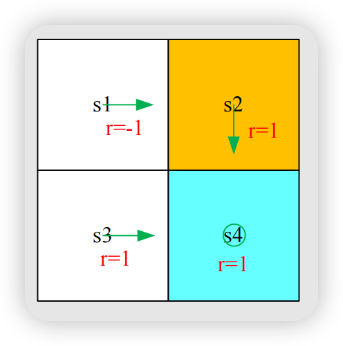
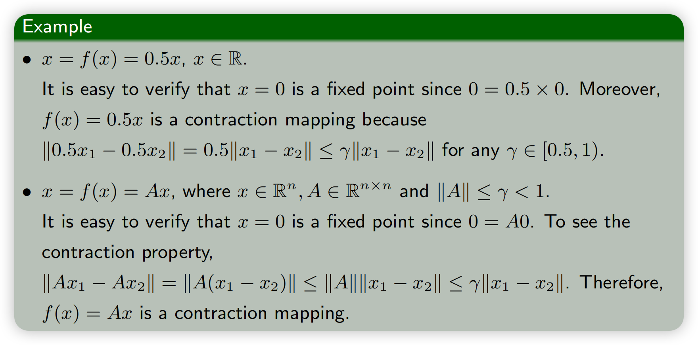
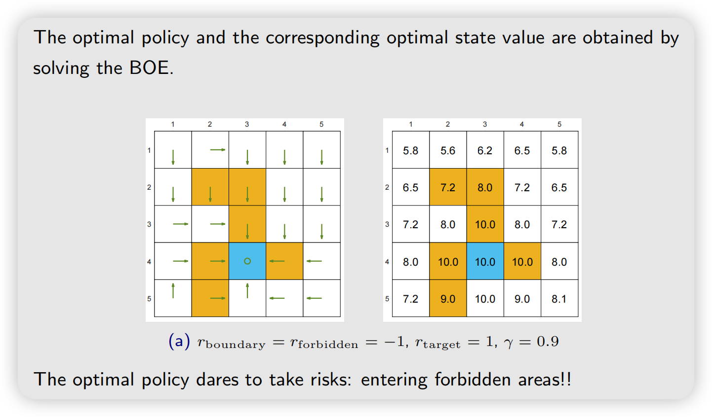

## Motivating examples
给定如下策略（令$\gamma=0.9$）：
{width=50%}

贝尔曼公式：
$$
\begin{aligned}
v_{\pi}(s_1) &= -1 + \gamma v_{\pi}(s_2), \\
v_{\pi}(s_2) &= +1 + \gamma v_{\pi}(s_4), \\
v_{\pi}(s_3) &= +1 + \gamma v_{\pi}(s_4), \\
v_{\pi}(s_4) &= +1 + \gamma v_{\pi}(s_4).
\end{aligned}
$$
解方程组得
**State values:** $v_{\pi}(s_4) = v_{\pi}(s_3) = v_{\pi}(s_2) = 10, v_{\pi}(s_1) = 8$

有了state value之后我们可以计算action values:

$$
\begin{aligned}
q_{\pi}(s_1, a_1) &= -1 + \gamma v_{\pi}(s_1) = 6.2, \\
q_{\pi}(s_1, a_2) &= -1 + \gamma v_{\pi}(s_2) = 8, \\
q_{\pi}(s_1, {\color{blue}a_3}) &= 0 + \gamma v_{\pi}(s_3) = 9, \\
q_{\pi}(s_1, a_4) &= -1 + \gamma v_{\pi}(s_1) = 6.2, \\
q_{\pi}(s_1, a_5) &= 0 + \gamma v_{\pi}(s_1) = 7.2.
\end{aligned}
$$

- 接下来的问题是 $\color{blue}\text{While the policy is not good, how can we improve it?}$
- Answer: We can improve the policy based on action values

目前的$\pi(a|s_1)$ 策略：

$$
\pi(a|s_1) = \begin{cases}
1 & a = a_2 \\
0 & a \neq a_2
\end{cases}
$$

显然这个策略不够好，因为从$s_1$向右走（$a_2$）会进入forbidden area。

观察上面的action value，$q_{\pi}(s_1,a_3)$最大，那么我们可以改进策略：

$$
\pi_{\star}(a|s_1) = \begin{cases}
1 & a = a_3 \\
0 & a \neq a_3
\end{cases}
$$

:::note[Question: why doing this can improve the policy?]
- Intuition: easy! Actions with greater values are better.
- Math: nontrivial!(不平凡的) 因为让当前这个action value最大未必全局最好
:::

## Optimal Policy

The state value could be used to evaluate if a policy is good or not: if

$$
v_{\pi_1}(s) \geq v_{\pi_2}(s) \quad \text{for all } s \in \mathcal{S}
$$

then $\pi_1$ is "better" than $\pi_2$.

:::important[Definition]
A policy $\pi^*$ is optimal if $v_{\pi^*}(s) \geq v_{\pi}(s)$ for all $s$ and for any other policy $\pi$.
:::

The definition leads to many questions:

- Does the optimal policy exist?
- Is the optimal policy unique?
- Is the optimal policy stochastic or deterministic?
- How to obtain the optimal policy?

To answer these questions, we study the *Bellman optimality equation*.

## Bellman optimality equation (BOE) 贝尔曼最优化公式

### Element-wise

贝尔曼方程（element-wise form）
$$
v_{\pi}(s) = \sum_{a} \pi(a|s) \left[ \sum_{r} p(r|s, a) r + \gamma \sum_{s'} p(s'|s, a) v_{\pi}(s') \right], \quad s \in \mathcal S
$$
右侧加上取最大值，得到**Bellman optimality equation (BOE)**

$$
\begin{aligned}
v(s) &= {\color{blue}\max_{\pi}} \sum_{a} {\color{blue}\pi(a|s)} \left( \sum_{r} p(r|s, a) r + \gamma \sum_{s'} p(s'|s, a) v(s') \right), \quad s \in \mathcal{S} \\
&= {\color{blue}\max_{\pi}} \sum_{a} {\color{blue}\pi(a|s)} q(s, a), \quad s \in \mathcal{S}
\end{aligned}
$$

:::note[max符号]
在
$$
\boxed{\max_{\pi} f(\pi)}
$$
里面，$\pi$ 是我们允许改变的变量，我们在所有可能的 $\pi$ 中寻找能让后面表达式f最大的那个。然后将使得$f(\pi)$最大的$\pi$找出来带入$f(\pi)$,就是$\max_{\pi} f(\pi)$的值。

举例：

$$
\max_x \left( -(x-2)^2 \right)=0
$$
因为当 $x=2$时最大。
:::

Remarks:

- $p(r|s,a), p(s'|s,a), r, \gamma$ are known.
- $v(s), v(s')$ are unknown and to be calculated.
- Is $\pi(s)$ known or unknown?
  - 贝尔曼公式$\pi$是给定的，贝尔曼最优公式是不给定的，你需要去求解 ${\color{blue}\argmax_{\pi}} \sum_{a} {\color{blue}\pi(a|s)} q(s, a), \quad s \in \mathcal{S}$ 然后带回公式

### Matrix-vector form

Bellman optimality equation (matrix-vector form):

$$
{\color{red}v = \max_{\pi}(r_{\pi} + \gamma P_{\pi} v)}
$$

where the elements corresponding to $s$ or $s'$ are

$$
\begin{aligned}
[r_{\pi}]_s &\triangleq \sum_{a} \pi(a|s) \sum_{r} p(r|s, a) r, \\
[P_{\pi}]_{s,s'} &= p(s'|s) \triangleq \sum_{a} \pi(a|s) \sum_{s'} p(s'|s, a)
\end{aligned}
$$

Here $\max_{\pi}$ is performed elementwise:

$$
\max_{\pi} \begin{bmatrix} * \\ \vdots \\ * \end{bmatrix} = \begin{bmatrix} \max_{\pi(s_1)} * \\ \vdots \\ \max_{\pi(s_n)} * \end{bmatrix}
$$

注意这里max作用于一个向量的时候是逐元素的，上面向量中也把下标写成了$\max_{\pi(s_i)}$来表示对每个s对应的action进行最大化

更准确的可以写成：

$$

\begin{bmatrix}
\max_{\pi(\cdot|s_1)}F_{s_1}(\pi)\\
\max_{\pi(\cdot|s_2)}F_{s_2}(\pi)\\
\vdots\\
\max_{\pi(\cdot|s_n)}F_{s_n}(\pi)
\end{bmatrix}

$$

因为一个完整 policy $\pi$ 本身其实就是：
$$
\boxed{
\pi=
\{
\pi(\cdot|s_1),
\pi(\cdot|s_2),
\dots,
\pi(\cdot|s_n)
\}
}
$$
也就是说，policy 是每个状态下 action 概率分布的集合。上面的向量中每个分量求出$\pi(\cdot | s_i)$ 最终合起来变成完整的使action value最大化的$\pi$

### Maximization on the right-hand side of BOE

$$
\begin{aligned}
v(s) &= {\color{blue}\max_{\pi}} \sum_{a} {\color{blue}\pi(a|s)} \left( \sum_{r} p(r|s, a) r + \gamma \sum_{s'} p(s'|s, a) v(s') \right), \quad s \in \mathcal{S} \\
&= {\color{blue}\max_{\pi}} \sum_{a} {\color{blue}\pi(a|s)} q(s, a), \quad s \in \mathcal{S}
\end{aligned}
$$
由于$\pi$是可以改变的，那么我们应该固定$q(s,a)$，所以上式：
$$
= \color{red} \max_{a \in \mathcal A(s)} q(s,a)
$$

where the optimality is achieved when

$$
\pi(a|s) = \begin{cases}
1 & a = a^* \\
0 & a \neq a^*
\end{cases}
$$

where $a^* = \arg\max_a q(s,a)$.

### Solve the Bellman optimality equation

The BOE is $v = \max_{\pi}(r_{\pi} + \gamma P_{\pi} v)$ , Let:

$$
f(v) := max_{\pi} (r_{\pi} + \gamma P_{\pi} v)
$$

BOE becomes:
$$
v=f(v)
$$

因为这是向量形式，拆开：
$$
v=
\begin{bmatrix}
v(s_1)\\
v(s_2)\\
\vdots\\
v(s_n)
\end{bmatrix}
=
\begin{bmatrix}
[f(v)]_{s_1}\\
[f(v)]_{s_2}\\
\vdots\\
[f(v)]_{s_n}
\end{bmatrix}
$$

where

$$
[f(v)]_s = \max_{\pi} \sum_{a} \pi(a|s) q(s,a), \quad s \in \mathcal{S}
$$

### Preliminaries: Contraction mapping Theorem

- **Fixed point**: $x \in X$ is a fixed point of $f : X \to X$ if

  $$
  f(x) = x
  $$

- **Contraction mapping (or contractive function)**: $f$ is a contraction mapping if

  $$
  \|f(x_1) - f(x_2)\| \leq \gamma \|x_1 - x_2\|
  $$

  where $\gamma \in (0, 1)$.

  - $\gamma$ must be strictly less than 1 so that many limits such as $\gamma^k \to 0$ as $k \to 0$ hold.
  - Here $\|\cdot\|$ can be any vector norm.

:::note[norm]
$\|\cdot\|\text{ can be any vector norm}$意思是定义 contraction mapping 时，你可以选择任意一种向量范数，例如
$$
\|x\|_1=\sum_i|x_i| \\

\|x\|_2=\sqrt{\sum_i x_i^2}
$$
或者
$$
\|x\|_\infty=\max_i|x_i|
$$
但是一旦你选定了某种向量 norm，矩阵$||A||$就应该理解成与这个向量 norm 相对应的 induced matrix norm（诱导矩阵范数）。它的统一定义是：
$$
\boxed{
\|A\|
=
\sup_{x\neq0}
\frac{\|Ax\|}{\|x\|}
}
$$
意思是：矩阵 $A$ 作为一个线性变换，最多能把向量的长度放大多少倍

所以你选什么向量 norm，就会诱导出相应的矩阵 norm。由这个定义：
$$
\|A\| \ge \frac{\|Ax\|}{\|x\|} , \quad \forall x \neq 0 \\
\iff \|A\| \|x\| \ge \|Ax\|, \quad \forall x \neq 0
$$
:::

:::note[Theorem (Contraction Mapping Theorem)]
For any equation that has the form of $x = f(x)$, if $f$ is a contraction mapping, then

- **Existence**: there exists a fixed point $x^*$ satisfying $f(x^*) = x^*$.
- **Uniqueness**: The fixed point $x^*$ is unique.
- **Algorithm**: Consider a sequence $\{x_k\}$ where $x_{k+1} = f(x_k)$, then $x_k \to x^*$ as $k \to \infty$. Moreover, the convergence rate is exponentially fast.
:::

这里这个Algorithm迭代法，画成函数图像比较像蛛网模型

### Solve the Bellman optimality equation

Let's come back to the Bellman optimality equation:

$$
v = f(v) = \max_{\pi}(r_{\pi} + \gamma P_{\pi} v)
$$

**Theorem (Contraction Property)**

$f(v)$ is a contraction mapping satisfying

$$
\|f(v_1) - f(v_2)\| \leq \gamma \|v_1 - v_2\|
$$

where $\gamma$ is the discount rate!

（证明没看qaq）

既然贝尔曼最优方程已经满足contraction property，那么直接用上contraction mapping theorem

:::note[Theorem (Existence, Uniqueness, and Algorithm)]
For the BOE $v = f(v) = \max_{\pi}(r_{\pi} + \gamma P_{\pi} v)$, there always **exists** a solution $v^*$ and the solution is **unique**. The solution could be solved iteratively by

$$
v_{k+1} = f(v_k) = \max_{\pi}(r_{\pi} + \gamma P_{\pi} v_k) \tag{1}
$$

This sequence $\{v_k\}$ converges to（收敛到） $v^*$ **exponentially fast** given any initial guess $v_0$. The convergence rate is determined by $\gamma$.
:::

**Important:** The algorithm in (1) is called the **value iteration algorithm**. We will analyze it in the next lecture! This lecture focuses more on the fundamental properties.

### Policy optimality

Suppose $v^{\star}$ is the solution to the Bellman optimality equation. It satisfies

$$
v^{\star} = \max_{\pi} (r_{\pi} + \gamma P_{\pi} v^{\star})
$$
设：
$$
\pi^{\star} = \arg \max_{\pi} (r_{\pi} + \gamma P_{\pi} v^{\star})
$$
则：
$$
v^{\star} = r_{\pi^{\star}} + \gamma P_{\pi^{\star}} v^{\star}
$$

此时$\pi^{\star}$是一个策略，并且$v^{\star} = v_{\pi^{\star}}$ 是$\pi^{\star}$所对应的state value

并且我们有结论，$\pi^{\star}$就是最优策略，并且$v^{\star}$就是最优策略所对应的state value

**Theorem（Policy Optimality）**

Suppose That $v^{\star}$ is the unique solution to $v = \max_{\pi} (r_{\pi} + \gamma + P_{\pi} v)$ , and $v_{\pi}$ is the state value function satisfying $v_{\pi} = r_{\pi} + \gamma + P_{\pi} v_{\pi}$ for any given policy $\pi$ , then:
$$
v^{\star} \ge v_{\pi}, \quad \forall \pi
$$

What does an optimal policy $\pi^\star$ look like?

$$
\pi^\star(s) = \arg\max_{\pi} \sum_a \pi(a|s) \underbrace{\left( \sum_r p(r|s,a) r + \gamma \sum_{s'} p(s'|s,a) v^\star(s') \right)}_{q^\star(s,a)}
$$

:::note[Theorem (Greedy Optimal Policy)]
*For any* $s \in \mathcal{S}$, *the deterministic greedy policy*

$$
\pi^\star(a|s) = \begin{cases} 1 & a = a^\star(s) \\ 0 & a \neq a^\star(s) \end{cases}
$$

（因为这里是$\pi$可以变化，需要固定$q^{\star}$）

*is an optimal policy solving the BOE. Here,*

$$
a^\star(s) = \arg\max_a q^\star(a, s),
$$

*where* $q^\star(s, a) \doteq \sum_r p(r|s,a) r + \gamma \sum_{s'} p(s'|s,a) v^\star(s')$.
:::

## Analyzing optimal policies

What factors determine the optimal state value and optimal policy?
It can be clearly seen from the BOE

$$
v(s) = \max_{\pi} \sum_a \pi(a|s) \left( \sum_r {\color{red}p(r|s,a) r} + {\color{red}\gamma } \sum_{s'} {\color{red} p(s'|s,a) v(s')} \right)
$$

这里红色的量是已知的（$\gamma, r$等等我们可以去设计），需要求解最优策略$\pi$和对应状态量$v$

that there are three factors:

- System model: $p(s'|s,a)$, $p(r|s,a)$
- Reward design: $r$
- Discount rate: $\gamma$

We next show how $r$ and $\gamma$ can affect the optimal policy.

这里有一个隐藏条件$r_{otherstep} = 0$

主要的规律是：
- $\gamma$大，策略远视，$\gamma$小，策略偏向即时reward
- $\gamma = 0$  The optimal policy becomes extremely short-sighted
- $r$的变化会改变策略，改变所有r： $r \rightarrow ar+b$不会改变最优策略
- $\gamma < 1$也会约束策略不会走特别长的步数
