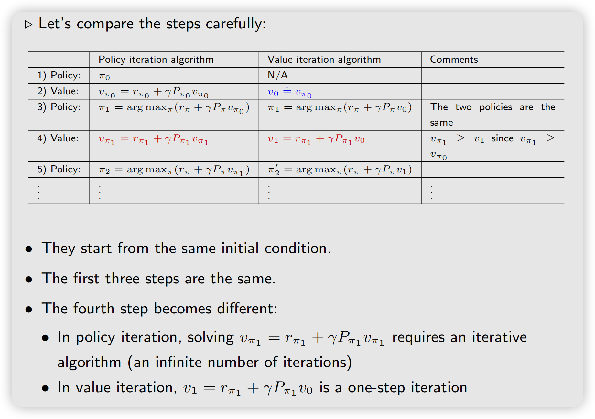
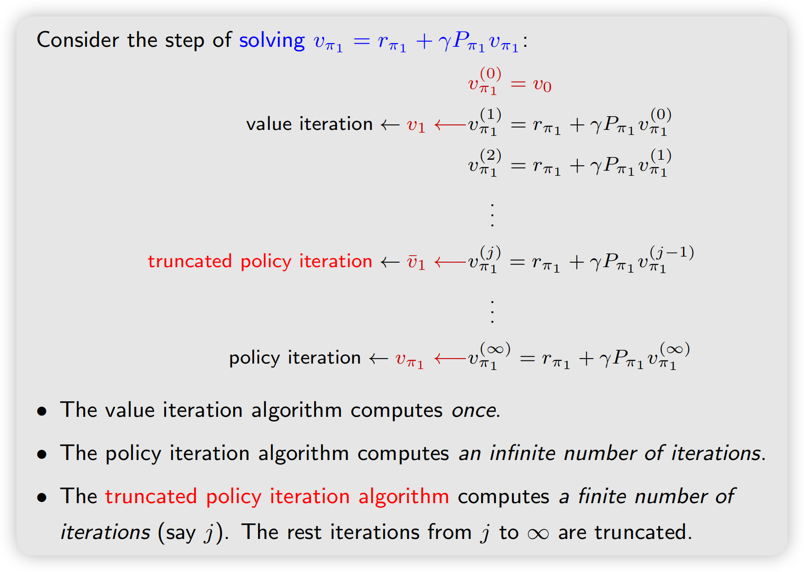
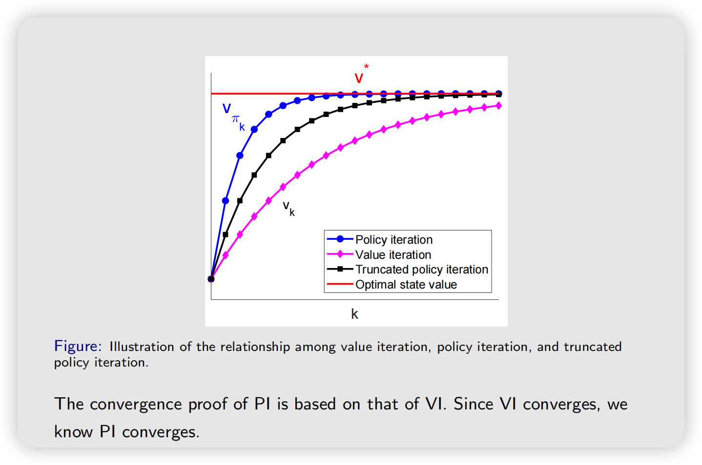

## Value iteration algorithm

### Step1: Policy update

给定初始向量$v_0$，迭代计算由$v_k$算出$\pi_{k+1}$

Matrix form：

$$
\pi_{k+1} = \arg\max_{\pi} (r_{\pi} + \gamma P_{\pi} v_k)
$$

（注意，矩阵形式不好理解的点在于，必须要知道初始$\pi_0$才能继续迭代，实际计算的时候我们根本不需要用到$P_{\pi}$矩阵，因此矩阵形式只是数学表示， 实际算法实现使用下面的element wise）

The elementwise form ：

$$
\pi_{k+1}(s) = \arg\max_{\pi} \sum_a \pi(a|s) \underbrace{\left( \sum_r p(r|s,a) r + \gamma \sum_{s'} p(s'|s,a) {\color{red}v_k(s')} \right)}_{{\color{red}q_k(s,a)}}, \quad s \in \mathcal{S}
$$

这里我们可以看到只要知道$v_k$ , 由于$p(r|s,a),r,\gamma,p(s'|s,a)$都是环境和已知变量，因此可以直接算出$q_k$，进而算出$\pi_{k+1}$

The optimal policy solving the above optimization problem is

$$
{\color{blue}\pi_{k+1}(a|s) = \begin{cases} 1 & a = a^*_k(s) \\ 0 & a \neq a^*_k(s) \end{cases}}
$$

where ${\color{blue}a^*_k(s) = \arg\max_a q_k(a,s)}$. $\pi_{k+1}$ is called a **greedy policy**, since it simply selects the greatest q-value.

### Step 2: Value update

因为上面我们算出了$\pi_{k+1}$，利用已知的$v_k$，然后继续迭代

The elementwise form of

$$
v_{k+1} = r_{\pi_{k+1}} + \gamma P_{\pi_{k+1}} v_k
$$
（注意这里的$v_k$不是严格的state value了，它只是一组向量，因为不满足贝尔曼公式）

is

$$
v_{k+1}(s) = \sum_a {\color{red}\pi_{k+1}(a|s)} \underbrace{\left( \sum_r p(r|s,a) r + \gamma \sum_{s'} p(s'|s,a) {\color{red}v_k(s')} \right)}_{{\color{red}q_k(s,a)}}, \quad s \in \mathcal{S}
$$

Since $\pi_{k+1}$ is greedy, the above equation is simply

$$
{\color{blue}v_{k+1}(s) = \max_a q_k(a,s)}
$$

### Pseudocode

**Procedure summary:**

$$
v_k(s) \to q_k(s,a) \to \text{greedy policy } \pi_{k+1}(a|s) \to \text{new value } v_{k+1} = \max_a q_k(s,a)
$$

```pseudocode title="Value iteration algorithm" number=1
@require The probability model $p(r|s,a)$ and $p(s'|s,a)$ for all $(s,a)$ are known
@ensure Optimal state value and optimal policy solving the Bellman optimality equation

Initialize $v_0$

While $v_k$ has not converged ($\|v_k - v_{k-1}\| > \text{threshold}$), for the $k$th iteration, do
  For every state $s \in \mathcal{S}$, do
    For every action $a \in \mathcal{A}(s)$, do
      q-value: $q_k(s,a) = \sum_r p(r|s,a) r + \gamma \sum_{s'} p(s'|s,a) v_k(s')$
    Maximum action value: $a^*_k(s) = \arg\max_a q_k(a,s)$
    Policy update: $\pi_{k+1}(a|s) = 1$ if $a = a^*_k$, and $\pi_{k+1}(a|s) = 0$ otherwise
    Value update: $v_{k+1}(s) = \max_a q_k(a,s)$
  end for
end while
```

## Policy iteration algorithm

给定一个初始策略$\pi_0$

### Step1: policy evaluation (PE)

根据迭代我们现在已经有了$\pi_k$ , 通过解贝尔曼啊方程得到这个策略对应的state value $v_{\pi_k}$

$$
v_{\pi_k} = r_{\pi_k} + \gamma P_{\pi_k} v_{\pi_k}
$$

解这个方程在chapter2说过需要用迭代法，设$v_{\pi_k}^{(j)}$为第$j$次迭代估计的$v_{\pi_k}$值，不断迭代让$v_{\pi_k}^{(j)} \rightarrow v_{\pi_k},\quad j \rightarrow \infty$

- Matrix-vector form: $v_{\pi_k}^{(j+1)} = r_{\pi_k} + \gamma P_{\pi_k} v_{\pi_k}^{(j)}, \quad j = 0, 1, 2, \ldots$

- Elementwise form:

$$
v_{\pi_k}^{(j+1)}(s) = \sum_a \pi_k(a|s) \left( \sum_r p(r|s,a) r + \gamma \sum_{s'} p(s'|s,a) {\color{red}v_{\pi_k}^{(j)}(s')} \right), \quad s \in \mathcal{S}
$$

Stop when $j$ is sufficiently large or $\|v_{\pi_k}^{(j+1)} - v_{\pi_k}^{(j)}\|$ is sufficiently small.

### Step 2: policy improvement (PI)

- Matrix-vector form: $\pi_{k+1} = \arg\max_\pi (r_\pi + \gamma P_\pi {\color{red}v_{\pi_k}})$

- Elementwise form:

$$
\pi_{k+1}(s) = \arg\max_\pi \sum_a \pi(a|s) \underbrace{\left( \sum_r p(r|s,a) r + \gamma \sum_{s'} p(s'|s,a) {\color{red}v_{\pi_k}(s')} \right)}_{q_{\pi_k}(s,a)}, \quad s \in \mathcal{S}.
$$

Here, $q_{\pi_k}(s,a)$ is the action value under policy $\pi_k$. Let

$$
a^*_k(s) = \arg\max_a q_{\pi_k}(a,s)
$$

Then, the greedy policy is

$$
\pi_{k+1}(a|s) = \begin{cases} 1 & a = a^*_k(s), \\ 0 & a \neq a^*_k(s). \end{cases}
$$

### Pseudocode

```pseudocode title="Policy iteration algorithm" number=2
@require The probability model $p(r|s,a)$ and $p(s'|s,a)$ for all $(s,a)$ are known
@ensure Optimal state value and optimal policy

Initialize $\pi_0$

While $v_{\pi_k}$ has not converged, for the $k$th iteration, do
  // Policy evaluation
  Initialize an arbitrary $v_{\pi_k}^{(0)}$
  While $v_{\pi_k}^{(j)}$ has not converged, for the $j$th iteration, do
    For every state $s \in \mathcal{S}$, do
      $v_{\pi_k}^{(j+1)}(s) = \sum_a \pi_k(a|s) \left[ \sum_r p(r|s,a) r + \gamma \sum_{s'} p(s'|s,a) v_{\pi_k}^{(j)}(s') \right]$
    end for
  end while
  // Policy improvement
  For every state $s \in \mathcal{S}$, do
    For every action $a \in \mathcal{A}$, do
      $q_{\pi_k}(s,a) = \sum_r p(r|s,a) r + \gamma \sum_{s'} p(s'|s,a) v_{\pi_k}(s')$
    end for
    $a^*_k(s) = \arg\max_a q_{\pi_k}(s,a)$
    $\pi_{k+1}(a|s) = 1$ if $a = a^*_k$, and $\pi_{k+1}(a|s) = 0$ otherwise
  end for
end while
```

## Truncated policy iteration algorithm

### Compare value iteration and policy iteration



如图:
- 策略迭代先有一个初始策略$\pi_0$，然后根据$\pi_0$算出对应的state value $v_{\pi_0}$, 用$v_{\pi_0}$来greedy更新$\pi_1$, 根据 $\pi_1$又可以解贝尔曼方程（迭代法）得到$v_{\pi_1}$
- 值迭代需要一个初始$v_0$，为了可比设为$v_{\pi_0}$ , 根据$v_0$贪心算出$\pi_1$ , 用$\pi_1,v_0$ 迭代算出$v_1$
- 注意右边comments： $v_{\pi_1} \ge v_{1}$ , 注意看红色的公式，两边都作用同一个策略 $\pi_1$ 的 Bellman operator
$$
T_{\pi_1}(v)
=
r_{\pi_1}+\gamma P_{\pi_1}v
$$
由于 $P_{\pi_1}$ 的元素都是非负概率，因此这个算子具有单调性：
$$
x\ge y
\quad\Longrightarrow\quad
T_{\pi_1}(x)\ge T_{\pi_1}(y)
$$
,因此$v_{\pi_1} \ge v_{\pi_0} \Rightarrow v_{\pi_1} \ge v_1$

或者也可以理解成，策略迭代是对于$P_{\pi_1}$迭代很多次的代的$v_{\pi_1}$，而$v_1$只是迭代一次得到的结果

下一步，如果我们把策略迭代的这一步红色公式$v_{\pi_1} = r_{\pi_1}+\gamma P_{\pi_1}v_{\pi_1}$迭代解法中的$v_{\pi_1}^{(0)} := v_0$ ，如图



### Pseudocode

```pseudocode title="Truncated policy iteration algorithm" number=3
@require The probability model $p(r|s,a)$ and $p(s'|s,a)$ for all $(s,a)$ are known
@ensure Optimal state value and optimal policy

Initialize $\pi_0$

While $v_k$ has not converged, for the $k$th iteration, do
  // Policy evaluation
  Initialize $v_k^{(0)} = v_{k-1}$, maximum iteration $j_{\text{truncate}}$
  While $j < j_{\text{truncate}}$, do
    For every state $s \in \mathcal{S}$, do
      $v_k^{(j+1)}(s) = \sum_a \pi_k(a|s) \left[ \sum_r p(r|s,a) r + \gamma \sum_{s'} p(s'|s,a) v_k^{(j)}(s') \right]$
    end for
  end while
  Set $v_k = v_k^{(j_{\text{truncate}})}$
  // Policy improvement
  For every state $s \in \mathcal{S}$, do
    For every action $a \in \mathcal{A}(s)$, do
      $q_k(s,a) = \sum_r p(r|s,a) r + \gamma \sum_{s'} p(s'|s,a) v_k(s')$
    end for
    $a^*_k(s) = \arg\max_a q_k(s,a)$
    $\pi_{k+1}(a|s) = 1$ if $a = a^*_k$, and $\pi_{k+1}(a|s) = 0$ otherwise
  end for
end while
```

### Convergence



Truncated Policy Iteration（截断策略迭代），可以理解为：
$$
\boxed{\text{Value Iteration 和 Policy Iteration 的中间形态}}
$$

- Policy Iteration 每次更新 policy 后，会把新 policy 的 value 几乎算到完全收敛；
- Value Iteration 只算一步就立刻重新更新 policy；
- Truncated Policy Iteration 则折中一下，只算有限 $j$ 步，然后就更新 policy。


$$
\text{Value Iteration}
\quad
\underbrace{\longleftarrow}_{j=1}
\quad
\text{Truncated PI}
\quad
\underbrace{\longrightarrow}_{j\to\infty}
\quad
\text{Policy Iteration}
$$
