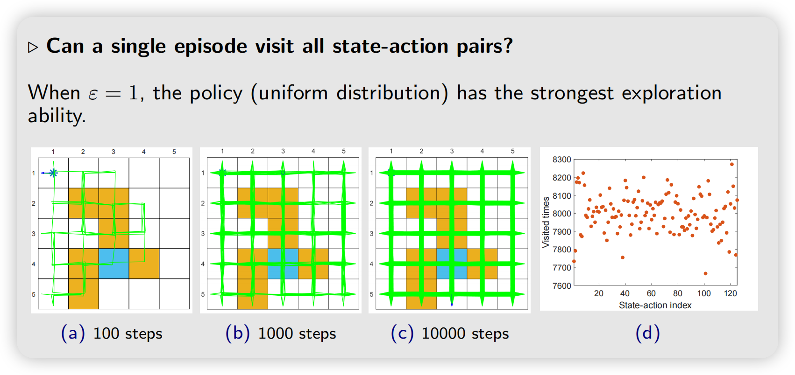
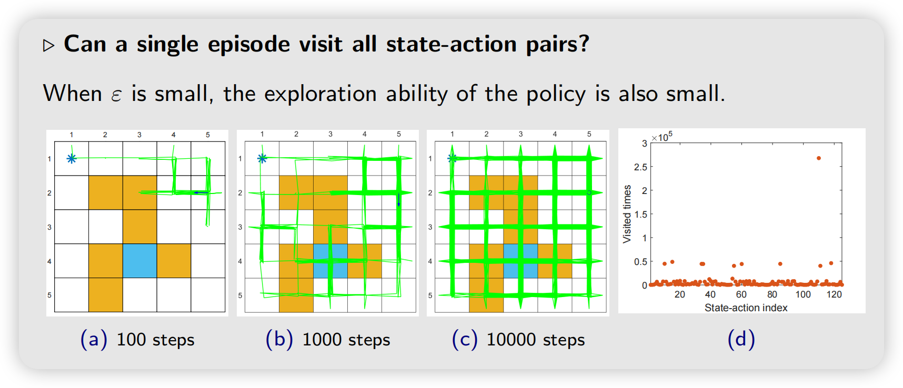

:::note[题外话]
chapter 4中的value iteration和policy iteration统称为model-based Reinforcement Learning（MBRL）, 更准确的来说是dynamic progranmming 动态规划的方法
:::

## Mean estimation

**Example: Flip a coin**

The result (either head or tail) is denoted as a random variable $X$

- if the result is head, then $X = +1$
- if the result is tail, then $X = -1$

The *aim* is to compute $\mathbb{E}[X]$.

**Method 1: with model**

Suppose the probabilistic model is known as
$$
p(X = +1) = 0.6, \quad p(X = -1) = 0.4
$$

Then, we can compute $\mathbb{E}[X]$ as
$$
\mathbb{E}[X] = 1 \cdot p(X = +1) + (-1) \cdot p(X = -1) = 1 \cdot 0.6 + (-1) \cdot 0.4 = 0.2
$$

**Method 2: model free**

- *Idea:* Flip the coin many times, and then calculate the average of the outcomes.

- Suppose we get a sample sequence: $\{x_1, x_2, \ldots, x_N\}$.
  Then, the mean can be approximated as

$$
\mathbb{E}[X] \approx \bar{x} = \frac{1}{N} \sum_{j=1}^{N} x_j.
$$

This is the idea of Monte Carlo estimation!

## MC Basics Algorithm

### 算法过程

Policy iteration has two steps in each iteration:

$$
\begin{cases}
\textbf{Policy evaluation:} & v_{\pi_k} = r_{\pi_k} + \gamma P_{\pi_k} v_{\pi_k} \\
\textbf{Policy improvement:} & \pi_{k+1} = \arg\max_\pi (r_\pi + \gamma P_\pi v_{\pi_k})
\end{cases}
$$

The elementwise form of the **policy improvement** step is:

$$
{\color{blue}\pi_{k+1}(s)} = \arg\max_\pi \sum_a \pi(a|s) \left[ \sum_r p(r|s,a) r + \gamma \sum_{s'} p(s'|s,a) v_{\pi_k}(s') \right]
$$
$$
= \arg\max_\pi \sum_a \pi(a|s) {\color{red}q_{\pi_k}(s,a)}, \quad s \in \mathcal{S}
$$

The key is to calculate ${\color{red}q_{\pi_k}(s,a)}$!

在policy iteration中，我们求$q_{\pi_k}(s,a)$的方法：
$$
q_{\pi_k}(s,a) = \sum_r p(r|s,a) r + \gamma \sum_{s'} p(s'|s,a) v_{\pi_k}(s')
$$
这其中需要model $p(r|s,a)$和$p(s'|s,a)$, 如果我们使用定义：
$$
q_{\pi_k}(s,a) = \mathcal E[G_t|s_t=s,A_t=a]
$$
这里我们可以用数据(samples or experiences)去对$G_t$进行一个mean estimation ：
- 从 $(s, a)$ 开始，根据 policy $\pi_k$ 可以进行 $N$ 次采样，获得$N$个episodes
- 设$\{g^{(i)}(s,a)\}$为刚才采样得到的样本，那么：
$$
q_{\pi_k}(s,a) = \mathbb{E}[G_t|S_t = s, A_t = a] \approx \frac{1}{N} \sum_{i=1}^{N} g^{(i)}(s,a).
$$
:color[Fundamental idea: When model is unavailable, we can use data.]{color=red}

### Summary

:::tip[]
原来的policy iteration算法的第一步policy evaluation的时候，是根据现有策略$\pi_k$解方程组得到state value $v_{\pi_k}$ , 然后用这个state value去得到$q_{\pi_k}$ . 由于第二步只用$q_{\pi_k}$，但MC Basic algorithm不需要去算state value，直接估计$q_{\pi_k}(s,a)$就行
:::
Given an initial policy $\pi_0$, there are two steps in the $k$th iteration.

- **Step 1: policy evaluation.** This step aims to estimate $q_{\pi_k}(s,a)$ for all $(s,a)$. Specifically, for each $(s,a)$, run sufficiently many episodes. The average of their returns, denoted as $q_k(s,a)$, is used to approximate $q_{\pi_k}(s,a)$.
  - :color[The first step of the *policy iteration algorithm* calculates $q_{\pi_k}(s,a)$ by firstly solving the state values $v_{\pi_k}$ from the Bellman equation. This requires the model.]{color=blue}
  - :color[The first step of the *MC Basic algorithm* is to directly estimate $q_k(s,a)$ from experiences samples. This does not require the model.]{color=blue}

- **Step 2: policy improvement.** This step aims to solve $\pi_{k+1}(s) = \arg\max_\pi \sum_a \pi(a|s) q_k(s,a)$ for all $s \in \mathcal{S}$. The greedy optimal policy is $\pi_{k+1}(a^*_k|s) = 1$ where $a^*_k = \arg\max_a q_k(s,a)$.
  - :color[This step is exactly the same as the second step of the policy iteration algorithm.]{color=blue}

**Description of the algorithm:**

```pseudocode title="MC Basic algorithm (a model-free variant of policy iteration)" number=4
@require Initial guess $\pi_0$
@ensure Optimal policy

For the $k$th iteration ($k = 0, 1, 2, \ldots$), do
  For every state $s \in \mathcal{S}$, do
    For every action $a \in \mathcal{A}(s)$, do
      Collect sufficiently many episodes starting from $(s,a)$ following $\pi_k$
      Policy evaluation:
      $q_{\pi_k}(s,a) \approx q_k(s,a) =$ average return of all the episodes starting from $(s,a)$
    end for
  end for
  Policy improvement:
  $a^*_k(s) = \arg\max_a q_k(s,a)$
  $\pi_{k+1}(a|s) = 1$ if $a = a^*_k$, and $\pi_{k+1}(a|s) = 0$ otherwise
end for
```

## MC Exporing Starts

The MC Basic algorithm:
- Advantage: reveal the core idea clearly!
- Disadvantage: too simple to be practical.
However, MC Basic can be extended to be more efficient.

### Exporing Starts

Exporing starts的意思是每一个 $(s,a)$ 都有机会直接成为某条 episode 的起点。

对于每一个状态 $s$，你至少得对它的各种 action 都有足够多多采样，才能可靠的对 $Q(s,a)$ 估计。但我们的策略是greedy的，例如：
$$
\pi(a_1|s)=1,\qquad
\pi(a_2|s)=0
$$
因为MC Exporing Starts的过程是每次选一个episode轨迹，如果去掉exporing starts这个条件的话因为$\pi(a_2|s)=0$，所以 $(s,a_2)$ 可能永远不会出现，导致无法充分探索。

因此Exploring Starts 做了一个比较强的假设：
$$
\boxed{
P(S_0=s,A_0=a)>0,\qquad \forall(s,a)
}
$$
即：每一个 state-action pair 都有非零概率被选为 episode 的起点。


### Use data more efficiently

Consider a grid-world example, following a policy $\pi$, we can get an episode such as

$$
s_1 \xrightarrow{a_2} s_2 \xrightarrow{a_4} s_1 \xrightarrow{a_2} s_2 \xrightarrow{a_3} s_5 \xrightarrow{a_1} \ldots
$$

**Visit:** every time a state-action pair appears in the episode, it is called a *visit* of that state-action pair.

- MC Basics 只把这条数据当作$q_{\pi}(s_1,a_2)$中众多采样中的一条
- 但事实上这条数据还可以用来估计$q_{\pi}(s_2,a_4)$,$q_{\pi}(s_2,a_3)$,$q_{\pi}(s_5,a_1)$: 假设$(s_5,a_1)$ pair之后的子轨迹计算得到的return为$g(s_5,a_1)$ , 那么$g(s_2,a_3) = r + \gamma (s_5,a_1)$

#### Data-efficient methods:
这个 episode 里：$(s_1,a_2)$出现了两次,到底用哪个？

- **First-visit MC**: 对于每条 episode：每个 $(s,a)$ 只使用第一次出现时的 return
- **Every-visit MC**: 即时一条episode中出现多次$(s,a)$, 每个 $(s,a)$ 出现时的 return都使用，当作$q_{\pi_k}(s,a)$的一次采样

### Update value estimate more efficiently

在 MC-based reinforcement 中另一个重要的问题是什么时候更新 policy，这里仍然有两种方式：

1. **Average return**: 在 MC basic 中，使用多个 episode 取平均的 average return 作为 action value 的估计值，这样需要获得多个 episode 后才能得到，效率较慢但是一次得到的 action value 较准确.

2. **Single episode（episode-by-episode）**: 每次获得一个 episode 后就立即更新 action value 的估计值，然后做policy improvement。也就是说，对 episode 中访问到的每个 $(s,a)$，利用对应的 $G_t$ 更新 $q(s,a)$,根据新的 $Q$ 改善 policy：
$$
\pi(s)
=
\arg\max_a q(s,a)
$$
然后再生成下一条 episode。这也就是MC Exporing Starts的做法。

那么这里有一个实现细节，要估计 $q_\pi(s,a)=\mathbb E[G_t\mid s,a]$，需要同一个 $(s,a)$ 的很多个 return sample，然后取平均。那么我们每次取一个episode就更新一次 $q(s,a)$，需要维护一个样本数目$N(s,a)$，使用incremental mean：
$$
N(s,a)\leftarrow N(s,a)+1
$$
$$
\boxed{
Q(s,a)
\leftarrow
Q(s,a)
+
\frac{1}{N(s,a)}
\left[
G-Q(s,a)
\right]
}
$$
（p.s. 这个公式直接用平均值的定义推导容易得出，但也可以这么理解，在原来的一串数中新加入一个跟平均值相等的数，均值不变， 那么我们可以先将插入的$G$拆成$G, G-Q(s,a)$，先插入$G$，再插入$G-Q(s,a)$（假装两次插入，实际上元素数量多一），显然后面插入的插入$G-Q(s,a)$对于均值的贡献是$\frac{1}{N(s,a)}
\left[
G-Q(s,a)
\right]$）
:::note[GPI]
上面介绍的算法都可以归入 generalized policy iteration(GPI) 的框架中，这种框架是指算法在 policy-evaluation 和 policy-improvement 之间不断循环迭代，而 policy-evaluation 可以精确也可以使用不精确的方式。许多 model-based 和 model-free 的强化学习算法都可以归入这一框架中.
:::

### pseudocode

```pseudocode title="MC Exploring Starts (an efficient variant of MC Basic)" number=5
@require Initial policy $\pi_0(a|s)$ and initial value $q(s,a)$ for all $(s,a)$
@ensure Optimal policy

Initialize $\text{Returns}(s,a) = 0$ and $\text{Num}(s,a) = 0$ for all $(s,a)$

For each episode, do
  // Episode generation
  Select a starting state-action pair $(s_0, a_0)$ (exploring-starts condition)
  Following the current policy, generate an episode of length $T$: $s_0, a_0, r_1, \ldots, s_{T-1}, a_{T-1}, r_T$
  // Initialization for each episode
  $g \leftarrow 0$
  For each step of the episode, $t = T-1, T-2, \ldots, 0$, do
    $g \leftarrow \gamma g + r_{t+1}$
    $\text{Returns}(s_t, a_t) \leftarrow \text{Returns}(s_t, a_t) + g$
    $\text{Num}(s_t, a_t) \leftarrow \text{Num}(s_t, a_t) + 1$
    // Policy evaluation
    $q(s_t, a_t) \leftarrow \text{Returns}(s_t, a_t) / \text{Num}(s_t, a_t)$
    // Policy improvement
    $\pi(a|s_t) = 1$ if $a = \arg\max_a q(s_t, a)$ and $\pi(a|s_t) = 0$ otherwise
  end for
end for
```

## MC ε-Greedy Algorithm

在实际情况中，对于每一个 state-action pair，使用 start 进行计算有可能很难实现(例
如真实的机器人在网格世界中每一次 start 都要物理搬运至相应格点)，我们需要想办法去掉exporing starts这个条件，这时候就需要将starts 改变成有保障的 visits.

### Soft Policy

**What is a soft policy?**

- A policy is *soft* if the probability to take any action is positive.
  - Deterministic policy: for example, greedy policy
  - Stochastic policy: for example, soft policy

**Why introducing soft policies?**

- With a soft policy, a few episodes that are sufficiently long :color[can visit every state-action pair.]{color=blue}

- Then, we do not need to have a large number of episodes starting from every state-action pair. Hence, the requirement of :color[exploring starts can be removed.]{color=blue}

### ε-greedy policies

ε-greedy policies 就是一种soft policy，它的思想是在 policy update 时，以前是新策略$\pi_{k+1}$选Action value最大的action，但现在是让Action value最大的action概率最大，其余的几个动作概率小。

$$
\pi(a|s) = \begin{cases}
{\color{blue}1 - \frac{\varepsilon}{|\mathcal{A}(s)|}(|\mathcal{A}(s)| - 1)}, & \text{for the greedy action}, \\
{\color{blue}\frac{\varepsilon}{|\mathcal{A}(s)|}}, & \text{for the other } |\mathcal{A}(s)| - 1 \text{ actions}.
\end{cases}
$$

where $\varepsilon \in [0, 1]$ and $|\mathcal{A}(s)|$ is the number of actions for $s$.

- **Example:** if $\varepsilon = 0.2$, then

$$
\frac{\varepsilon}{|\mathcal{A}(s)|} = \frac{0.2}{5} = 0.04, \qquad 1 - \frac{\varepsilon}{|\mathcal{A}(s)|}(|\mathcal{A}(s)| - 1) = 1 - 0.04 \times 4 = 0.84
$$

- The chance to choose the greedy action is always greater than other actions, because

$$
1 - \frac{\varepsilon}{|\mathcal{A}(s)|}(|\mathcal{A}(s)| - 1) = 1 - \varepsilon + \frac{\varepsilon}{|\mathcal{A}(s)|} \ge \frac{\varepsilon}{|\mathcal{A}(s)|}
$$

:color[$\varepsilon$-greedy policies can balance exploitation（利用，选择最优action） and exploration.]{color=blue}

- When $\varepsilon \to 0$, it becomes greedy!

$$
\pi(a|s) = \begin{cases}
1 - \frac{\varepsilon}{|\mathcal{A}(s)|}(|\mathcal{A}(s)| - 1) {\color{blue}= 1}, & \text{for the greedy action}, \\
\frac{\varepsilon}{|\mathcal{A}(s)|} {\color{blue}= 0}, & \text{for the other } |\mathcal{A}(s)| - 1 \text{ actions}.
\end{cases}
$$

**More exploitation but less exploration.**

- When $\varepsilon \to 1$, it becomes a uniform distribution.

$$
\pi(a|s) = \begin{cases}
1 - \frac{\varepsilon}{|\mathcal{A}(s)|}(|\mathcal{A}(s)| - 1) {\color{blue}= \frac{1}{|\mathcal{A}(s)|}}, & \text{for the greedy action}, \\
\frac{\varepsilon}{|\mathcal{A}(s)|} {\color{blue}= \frac{1}{|\mathcal{A}(s)|}}, & \text{for the other } |\mathcal{A}(s)| - 1 \text{ actions}.
\end{cases}
$$

**More exploration but less exploitation.**

用这种方法，每一个 action 都有正概率被选择，那么只需一个足够长的 episode 也可以访问每一个 state-action pair 很多次，就不需要将每个state-action pair作为起点了，我们成功的去掉了exporing starts的要求。


这两张图也是balance exploitation and exploration的体现。

### MC ε-Greedy algorithm

:color[Originally,]{color=blue} the policy improvement step in MC Basic and MC Exploring Starts is to solve

$$
\pi_{k+1}(s) = \arg\max_{\pi \in {\color{blue}\Pi}} \sum_a \pi(a|s) q_{\pi_k}(s,a).
$$

（即在所有policy中寻找一个使得那个式子值最大的policy）

where :color[$\Pi$ denotes the set of all possible policies.]{color=blue} The optimal policy here is

$$
\pi_{k+1}(a|s) = \begin{cases} 1, & a = a^*_k, \\ 0, & a \neq a^*_k, \end{cases}
$$

where $a^*_k = \arg\max_a q_{\pi_k}(s,a)$.

:color[Now,]{color=blue} the policy improvement step is changed to solve

$$
\pi_{k+1}(s) = \arg\max_{\pi \in {\color{blue}\Pi_\varepsilon}} \sum_a \pi(a|s) q_{\pi_k}(s,a),
$$

（即在所有ε-greedy policy中寻找一个使得那个式子值最大的policy）

where :color[$\Pi_\varepsilon$ denotes the set of all $\varepsilon$-greedy policies with a fixed value of $\varepsilon$.]{color=blue} The optimal policy here is

$$
\pi_{k+1}(a|s) = \begin{cases} 1 - \frac{|\mathcal{A}(s)| - 1}{|\mathcal{A}(s)|}\varepsilon, & a = a^*_k, \\ \frac{1}{|\mathcal{A}(s)|}\varepsilon, & a \neq a^*_k. \end{cases}
$$

### pseudocode

```pseudocode title="MC ε-Greedy (a variant of MC Exploring Starts)" number=6
@require Initial policy $\pi_0(a|s)$ and initial value $q(s,a)$ for all $(s,a)$
@ensure Optimal policy

Initialize $\text{Returns}(s,a) = 0$ and $\text{Num}(s,a) = 0$ for all $(s,a)$. $\varepsilon \in (0, 1]$

For each episode, do
  // Episode generation
  Select a starting state-action pair $(s_0, a_0)$ (the exploring starts condition is not required)
  Following the current policy, generate an episode of length $T$: $s_0, a_0, r_1, \ldots, s_{T-1}, a_{T-1}, r_T$
  // Initialization for each episode
  $g \leftarrow 0$
  For each step of the episode, $t = T-1, T-2, \ldots, 0$, do
    $g \leftarrow \gamma g + r_{t+1}$
    $\text{Returns}(s_t, a_t) \leftarrow \text{Returns}(s_t, a_t) + g$
    $\text{Num}(s_t, a_t) \leftarrow \text{Num}(s_t, a_t) + 1$
    // Policy evaluation
    $q(s_t, a_t) \leftarrow \text{Returns}(s_t, a_t) / \text{Num}(s_t, a_t)$
    // Policy improvement
    Let $a^* = \arg\max_a q(s_t, a)$ and
    $\pi(a|s_t) = \begin{cases} 1 - \frac{|\mathcal{A}(s_t)| - 1}{|\mathcal{A}(s_t)|}\varepsilon, & a = a^* \\ \frac{1}{|\mathcal{A}(s_t)|}\varepsilon, & a \neq a^* \end{cases}$
  end for
end for
```
