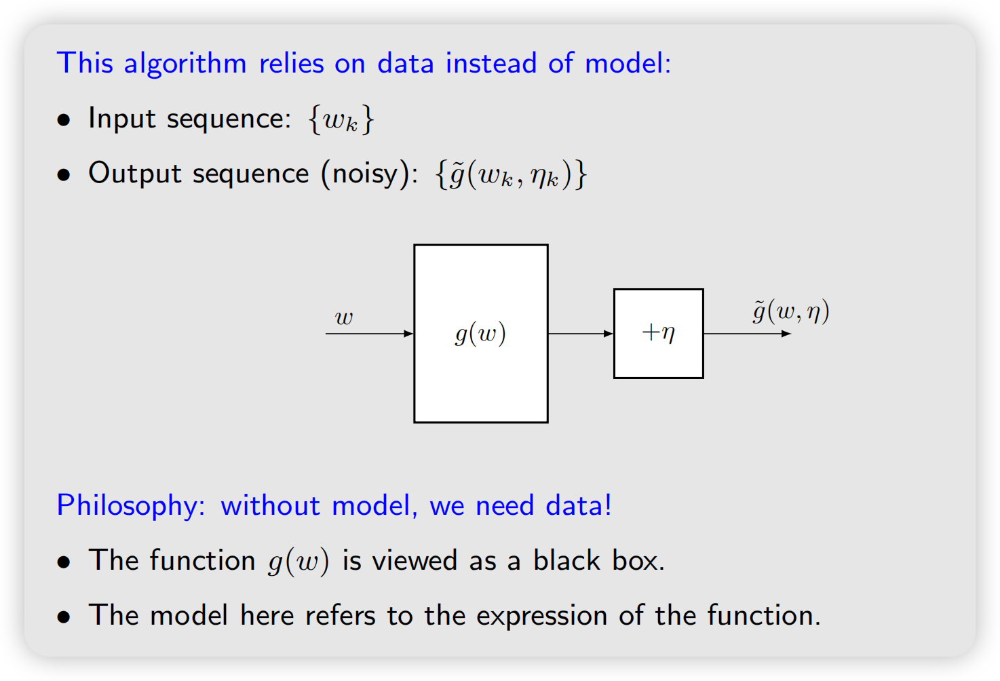
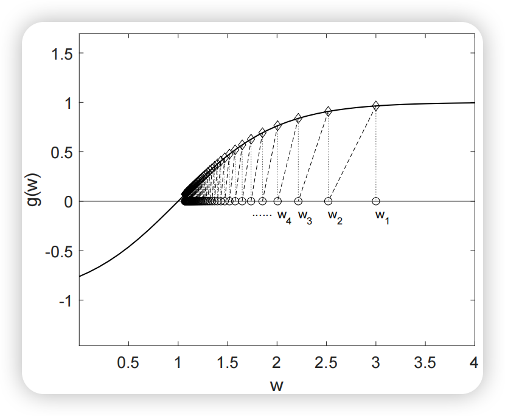

## Motivating example：Mean estimation

**Revisit** the mean estimation problem:

- Consider a random variable $X$.
- Suppose that we collected a sequence of iid samples $\{x_i\}_{i=1}^N$.
- Our aim is to estimate $\mathbb{E}[X]$.
- The expectation of $X$ can be approximated by

$$
\mathbb{E}[X] \approx \bar{x} := \frac{1}{N} \sum_{i=1}^N x_i.
$$

- This approximation is the basic idea of Monte Carlo estimation.
- We know that $\bar{x} \to \mathbb{E}[X]$ as $N \to \infty$.

### Incremental mean estimation

这个其实在chapter 5的时候已经有提到，这里用一个不同的视角

In particular, suppose
$$
w_{k+1} = \frac{1}{k} \sum_{i=1}^k x_i \quad k = 1,2,\ldots
$$
and hence:
$$
w_k = \frac{1}{k-1} \sum_{i=1}^{k-1} x_i \quad k = 2,3,\ldots
$$

Then, $w_{k+1}$ can be expressed in terms of $w_k$ as

$$
\begin{aligned}
w_{k+1} &= \frac{1}{k} \sum_{i=1}^k x_i = \frac{1}{k} \left( \sum_{i=1}^{k-1} x_i + x_k \right) \\
&= \frac{1}{k} ((k-1)w_k + x_k) = w_k - \frac{1}{k}(w_k - x_k).
\end{aligned}
$$

Therefore, we obtain the following iterative algorithm:

$$
\color{red}{w_{k+1} = w_k - \frac{1}{k}(w_k - x_k).}
$$

那么我们用初始值$w_1=w_2=x_1$，之后放进去不断迭代，我们可以计算验证$w_{k+1} = \frac{1}{k} \sum _{i+1}^k x_i$ , $w_k$就会逐渐收敛到$\mathbb{E}[X]$

The mean estimate is not accurate in the beginning due to insufficient samples. However, it is better than nothing. As more samples are obtained, the estimate can be improved gradually (that is $w_k \rightarrow \mathbb{E}[X] \text{ as } k \to \infty$ ).

### general expression

Furthermore, consider an algorithm with a more general expression:

$$
w_{k+1} = w_k - \color{red}{\alpha_k}(w_k - x_k),
$$

where $1/k$ is replaced by $\alpha_k > 0$.

:::note[A sepcial SA algorithm]
- 那么这个扩展之后到迭代式是否最终还会收敛到$\mathbb{E}[X]$？我们将证明：若数列 $\{\alpha_k\}$满足某些条件，则答案是肯定的
- 这也是Stochastic Approximation（随机逼近）算法和随机梯度下降的特殊情形
:::

## Robbins-Monro algorithm

### Background

- 随机逼近 SA 是一大类利用带噪声的随机观测，通过不断迭代去求方程根或者优化解的方法。

- 最典型的问题是，我们想解：$h(\theta)=0$，就是普通的root finding，但是如果$h(\theta)$是不可微的，或者我们只能观测到$h(\theta)$的带噪声版本$h(\theta) + \epsilon$，那么我们该如何求解呢？

- 比如：
$$
H(\theta,\xi)
$$
满足：
$$
\boxed{
\mathbb E[H(\theta,\xi)\mid\theta]=h(\theta)
}
$$
我们不知道真正的 $h(\theta)$，但每次可以采一个随机样本：
$$
H(\theta,\xi_k).
$$
那就可以通过随机迭代逼近 $$h(\theta)=0$$ 的根。

- Robbins-Monro (RM) algorithm is a pioneering work in the field of stochastic approximation.
- The famous stochastic gradient descent algorithm is a special form of the
RM algorithm

### RM algorithm description

:::theorem[Root finding]{label="Problem statement"}
Suppose we would like to find the root of the equation
$$
g(w) = 0
$$
where $w \in \mathbb R$ is the variable to be solved and $g: \mathbb R \to \mathbb R$ is a function.

(这里为了方便用了标量，实际上RM算法也可以处理向量情况$w \in \mathbb R^d , \quad g: \mathbb R^n \to \mathbb R^n$)
:::

- Many problems can be eventually converted to this root finding problem. For example, suppose $J(w)$ is an objective function to be minimized. Then, the optimization problem can be converted to

$$
g(w) = \nabla_w J(w) = 0
$$

- Note that an equation like $g(w) = c$ with $c$ as a constant can also be converted to the above equation by rewriting $g(w) - c$ as a new function.

- 经典 RM 的应用场景是$g(w)$是一个未知的黑盒函数（例如神经网络），我们只能获得带噪输出：

$$
\tilde{g}(w, \eta) = g(w) + \eta
$$

其中 $\eta$ 为观测噪声.

:::theorem[RM Algorithm]{label="Algorithm"}
The Robbins-Monro (RM) algorithm that can solve this problem is as follows:

$$
w_{k+1} = w_k - a_k \tilde{g}(w_k, \eta_k), \quad k = 1,2,3,\ldots
$$

where

- $w_k$ is the $k$th estimate of the root
- $\tilde{g}(w_k, \eta_k) = g(w_k) + \eta_k$ is the $k$th noisy observation‹›
- $a_k$ is a positive coefficient.
:::
这一页PPT比较形象：

### Illustrative examples

一个例子，取$g(w) = \tanh(w-1)$ 那么根为$w^{\star} = 1$ , 取参数$w_1=3,a_k=\frac{1}{k},\eta_k = 0$

此时RM算法为
$$
w_{k+1} = w_k - \frac{1}{k} {g}(w_k)
$$
因为$\tilde{g}(w_k,\eta_k) = g(w_k)$ when $\eta_k=0$
::::columns
:::column[Simulation results]
{width=100%}
:::

:::column[description]
- 如图，对于两点$(w_k,0),(w_k,g(w_k))$，它们处于同一垂直线上，求解下一个估计值$w_{k+1}=w_k-a_k g(w_k)$时，如果$a_k$足够小（我们又知道$a_k>0$）,那么$a_k g(w_k)$相当于将这个垂直线段长度按照某个比例缩小，$w_{k+1} < w_k$
- 同理，当 $\color{blue}{w_k < w^*}$ 时，我们有 $g(w_k) < 0$。则 $\color{blue}{w_{k+1} = w_k - a_k g(w_k) > w_k}$，且 $w_{k+1}$ 比 $w_k$ 更接近 $w^*$。
:::
::::
### Convergence propertie

:::theorem[Robbins-Monro Theorem]
In the Robbins-Monro algorithm, if
1) $0 < c_1 \leq \nabla_w g(w) \leq c_2$ for all $w$;
2) $\sum_{k=1}^\infty a_k = \infty$ and $\sum_{k=1}^\infty a_k^2 < \infty$;
3) $\mathbb{E}[\eta_k | \mathcal{H}_k] = 0$ and $\mathbb{E}[\eta_k^2 | \mathcal{H}_k] < \infty$;
where $\mathcal{H}_k = \{w_k, w_{k-1}, \ldots\}$, then $w_k$ converges with probability 1 (w.p.1) to the root $w^*$ satisfying $g(w^*) = 0$.
:::

### Apply to mean estimation

1) Consider a function:

$$
g(w) \doteq w - \mathbb{E}[X].
$$

Our aim is to solve $g(w) = 0$. If we can do that, then we can obtain $\mathbb{E}[X]$.

- 这样Mean estimation (i.e., finding $\mathbb{E}[X]$) 就被我们转化成了一个root finding问题 (i.e., solving $g(w) = 0$).
- 当然这里的$g(w)$是未知的，因为我们不知道$\mathbb{E}[X]$

2) The observation we can get is

$$
\tilde{g}(w, x) \doteq w - x, \quad \tilde{g}(w_k, x_k) \doteq w_k - x_k,
$$

where
$$
x , x_k \overset{\text{i.i.d.}}{\sim}X

$$

$x_k$ is k-th sample of $X$,  because we can only obtain samples of $X$.  Note that

$$
\begin{aligned}
\tilde{g}(w, \eta) &= w - x = w - x + \mathbb{E}[X] - \mathbb{E}[X] \\
&= (w - \mathbb{E}[X]) + (\mathbb{E}[X] - x) \doteq g(w) + \eta,
\end{aligned}
$$

Thus
$$
\tilde{g}(w_k, \eta_k) = g(w_k) + \eta_k = w_k-x_k
$$

3) The RM algorithm for solving $g(x) = 0$ is

$$
w_{k+1} = w_k - \alpha_k \tilde{g}(w_k, \eta_k) = w_k - \alpha_k(w_k - x_k),
$$

which is exactly the mean estimation algorithm. The convergence naturally follows. Here we verify it.

1) $g(w)$ 的导数上下有界且为正
$$
\nabla_wg(w)=g'(w) = 1
$$
满足

2) 步长$\alpha_k$满足两个级数条件

对于普通 incremental sample mean，我们选择：
$$
\alpha_k=\frac1k
$$
由分析学结论
$$
\sum_{k=1}^{\infty} \frac{1}{k} = \infty , \quad \sum_{k=1}^{\infty} \left(\frac{1}{k}\right)^2 = \frac{\pi^2}{6} < \infty
$$
满足

3) 噪声是条件零均值，并且二阶矩有限

记$\mathbb E[X] = \mu$,我们上面已经定义了
$$
\eta_k = \mathbb E[X] - x_k = \mu - x_k
$$
Robbins-Monro Theorem要求：
$$
\mathbb E[\eta_k\mid\mathcal H_k]=0, \quad \mathbb E[\eta_k^2\mid\mathcal H_k]<\infty.
$$
计算：
$$
\begin{aligned}
\mathbb E[\eta_k\mid\mathcal H_k] &= \mathbb E[\mu - x_k\mid\mathcal H_k] \\
&= \mu - \mathbb E[x_k\mid\mathcal H_k] = \mu - \mu = 0 \\
\mathbb E[\eta_k^2\mid\mathcal H_k] &= \mathbb E[(\mu - x_k)^2 \mid \mathcal H_k] \\
&= \mathbb E[(\mu - x_k)^2] \\
&= \mathbb E[(\mu - X)^2] \\
&= Var(X) < \infty
\end{aligned}
$$
满足。

因此 Robbins-Monro theorem 告诉我们：
$$

w_k\xrightarrow{\text{w.p.1}}w^* \\
g(w^*) = 0 \iff w^* = \mathbb E[X]

$$
即
$$
的

w_k\xrightarrow{\text{w.p.1}}\mathbb E[X]

$$
