## Vocabularies

interleaving v.插入. n.交错

## Concurrency and critical section

:::note[Concurrency]
Concurrency is the act of multiple processes (or threads) executing at the same time. When multiple physical CPUs are available, the processes may execute in parallel. On a single CPU, concurrency may be achieved by time-sharing.
:::

:::note[critical section(CS)]
A critical section is a segment of code that cannot be entered by a process while another process is executing a corresponding segment of the code.
:::

Any solution to the critical section (CS) problem must satisfy the following requirements:
1. Guarantee **mutual exclusion**: Only one process may be executing within the CS.
2. Prevent **lockout**: A process not attempting to enter the CS must not prevent other processes from entering the CS.
3. Prevent **starvation**: A process (or a group of processes) must not be able to repeatedly enter the CS while other processes are waiting to enter.
4. Prevent **deadlock**: Multiple processes trying to enter the CS at the same time must not block each other indefinitely.

## Process cooperation ： Producer-consumer synchronization.

Producer生产数据放到buffer中，消费者从buffer中消费数据。

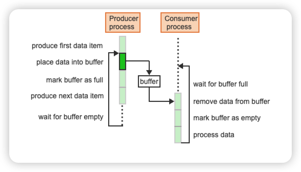

:::caution[buffer]
The buffer isn't a critical section, it's a data structure.
:::

## Semaphore （信号量）

:::note[Semaphore]
Semaphores are general-purpose primitives that allow solving a variety of synchronization problems in a systematic manner.

A semaphore s is a non-negative integer variable that can be accessed using only two special operations, P and V.
- V(s) / wait(): increment s by 1
- P(s) / signal() : if s > 0, decrement s by 1, otherwise wait until s > 0 ; 表示释放一个资源

:::
The implementation of P and V must guarantee that:
- If several processes simultaneously invoke P(s) or V(s), the operations will occur sequentially in some arbitrary order.
- If more than one process is waiting inside P(s) for s to become > 0 , one of the waiting processes is selected to complete the P(s) operation. The selection can be at random but a typical implementation maintains the blocked processes in a queue processed in FIFO order.

### The CS problem using semaphores
A single semaphore, initialized to 1, is sufficient to solve the problem for any number of processes.
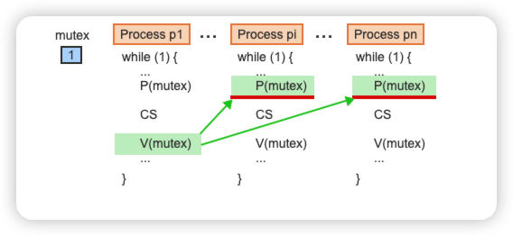

### The bounded-buffer problem （有界缓冲区问题）

在实际的操作系统中，内存资源是有限的。我们不可能给生产者提供一个无限大的缓冲区去存放数据。因此，缓冲区通常被设计成一个固定大小的数组（如图中的 $0$ 到 $N-1$ 个槽位）。为了让这个固定大小的数组能够被循环利用，操作系统引入了环形缓冲区（Circular Buffer）的概念。

- next_in（写入指针）：指向缓冲区中下一个空闲的槽位。生产者只要生产了数据，就会放到这个位置，然后指针向后移动一格。
- next_out（读取指针）：指向缓冲区中下一个有数据的槽位。消费者会从这个位置取走数据，取完后指针向后移动一格。
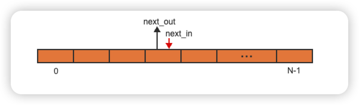

:::tip[细节]
- Initially, next_in = next_out.
- Whenever next_in = next_out, buffer slots are empty or full.
- When the producer and the consumer run at approximately the same constant speed, then the buffer should consist of a **small** number of slots.
- When the producer always runs much faster than the consumer then the buffer should consist of a **small** number of slots.
- When the producer and the consumer run at highly varying speeds then the buffer should consist of a **large** number of slots.
:::

### The bounded-buffer problem using semaphores

Two semaphores:
- e (empty slots)：表示缓冲区里还有多少个空槽位。初始值为 $n$（一开始全是空的）。这对生产者来说就是“可写入的额度”。
- f (full buffer slots)：表示缓冲区里有多少个已被填满的槽位。初始值为 $0$。这对消费者来说就是“可读取的数据量”
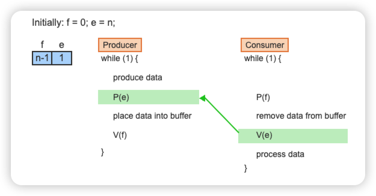

## Implementation of semaphores

### Hardware support for synchronization

:::note[原子操作: TS]
The test-and-set instruction (TS) copies a variable into a register and sets the variable to zero in one indivisible machine cycle. Test-and-set has the form TS(R, x) where R is a register and x is a memory location and performs the following operations:
```c title="TS.c"
Copy x into R
Set x to 0
```
:::
:::note[lock]
A lock is a synchronization barrier through which only one process can pass at a time. TS allows an easy implementation of a lock.
:::

<details>
<summary>展开查看例题</summary>

If R = 1 and x = 0, then after executing TS(R, x) the values become

> R=0, x=0

</details>

#### 自旋锁
设定：x = 1 代表锁空闲，x = 0 代表锁被占用，代码：
```c title="spinlock.c"
do TS(R1, x) while (R1 == 0)
next instruction
```
第一行中如果R1=0的话就不断while循环等待

### Binary semaphores (二元信号量)

A binary semaphore can take only the values 0 or 1. Pb and Vb are the simplified P and V operations that manipulate binary semaphores. Pb and Vb on the binary semaphore sb can be implemented directly using the TS instruction:
```c title="Pb.c"
sb = 1 // Vb(sb)
do TS(R,sb) while R == 0 // Pb(sb)
```

:::note[Busy-waiting ]
Busy-waiting is the act of repeatedly executing a loop while waiting for some condition to change. Busy-waiting consumes CPU resources and should be avoided whenever possible. The implementation of Pb(sb) using TS is very simple but suffers from the drawback of busy-waiting.当一个进程执行 Pb 发现资源被占用时，它不会去休眠，而是在这个 while 循环里疯狂空转，不断消耗 CPU 资源。这在实际的操作系统设计中（尤其是单核 CPU 上）是非常糟糕的，通常只用于预期等待时间极短的多核场景。
:::

下图是二元信号量解决临界区问题（只允许1个process进入），容量为1的有界缓冲区
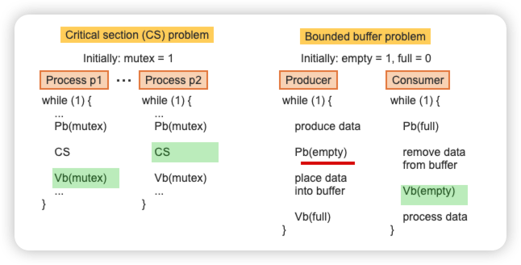

### Implementing P and V operations on general semaphores

在之前的学习中，无论是自旋锁还是基础的二元信号量，遇到资源被占用时，进程都会在原地死循环（自旋）。这在实际的操作系统调度中极其浪费 CPU 资源。这张图提供了一个完美的软件层解决方案。

A general semaphore s can be implemented using a regular integer variable manipulated by the functions P(s) and V(s). To guarantee that only one operation at a time can access and manipulate s, a binary semaphore is used.

The variable s serves a **dual purpose**:

- When s is greater or equal 0, s represents the value of the semaphore.
- Whenever s falls below 0, the absolute value of s represents the number of processes blocked on the semaphore.

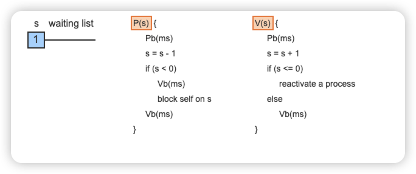

:::note[为什么代码里还要用到 Pb(ms) 和 Vb(ms)?]
这里的 ms 是一个内部的二元信号量（相当于一把互斥锁 Mutex）。
因为 s 这个变量本身和 waiting list 这个队列，是由多个进程共享的数据结构。如果在修改 s = s - 1 的一半时发生了进程切换，数据就全乱了。所以，必须用 Pb(ms) 和 Vb(ms) 把修改 s 的过程“包裹”起来，确保这是一个原子操作（不可分割）。
:::

<details>
<summary>具体流程</summary>

阶段 1：进程 A 申请资源失败，进入休眠
1. 进程 A 执行 P(s)，首先 Pb(ms) 拿到互斥锁。
2. s = s - 1，发现 $s < 0$。
3. 进程 A 准备去睡觉。但在睡前，它必须把锁交出来，于是执行了 if 里面的 内层 Vb(ms)。
4. 进程 A 执行 block self on s，陷入沉睡。

阶段 2：进程 B 释放资源，唤醒 A（接力棒传递开始）
1. 进程 B 执行 V(s)，首先 Pb(ms) 拿到了互斥锁（因为 A 睡前交出来了）。
2. s = s + 1，发现 $s \le 0$，说明 A 正在睡觉排队。
3. 进程 B 执行 reactivate a process，把 A 从等待队列里唤醒。
4. 【高能预警】 注意看 V(s) 的代码，因为走了 if 分支，它没有执行 else 里的 Vb(ms)！进程 B 就这样带着未释放的互斥锁 ms 结束了 V(s)。它去哪了？它把互斥锁 ms 就像接力棒一样，隔空传给了刚刚醒来的进程 A。

阶段 3：进程 A 醒来，完成最后的收尾
1. 进程 A 从 block self on s 的下一行醒来。
2. 此时，进程 A 手里神奇地拥有了互斥锁 ms（这是 B 刚才强行塞给它的）。
3. 进程 A 离开 if 块，执行最后那行 外层 Vb(ms)。
4. 进程 A 替 B 释放了互斥锁，然后心满意足地离开 P(s)。

</details>

## Monitors（管程）

:::note[monitor]
A monitor is a high-level synchronization primitive implemented using P and V operations. Following the principles of abstract data types, a monitor encapsulates data along with functions through which the data may be accessed and manipulated.
:::
:::note[condition variable]
A condition variable is a named queue on which processes can wait for some condition to become true.
:::
The implementation of a monitor must:
- guarantee that the functions are mutually exclusive. Thus only one process at a time may be executing inside a monitor. (同一时间只能有一个进程在管程内运行)
- provide condition variables such that a process can step outside of the monitor while waiting for a condition and thus not prevent other processes from entering the monitor.(提供条件变量，以便进程在等待条件满足时可以退出管程，从而不会阻止其他进程进入管程。)

A condition variable c is accessed using two special operations:
- **c.wait** causes the executing process to block and be placed on a waiting queue associated with the condition variable c. c.wait 会导致执行进程阻塞，并被放入与条件变量 c 关联的等待队列中。
- **c.signal** reactivates the process at the head of the queue associated with the condition variable c. 重新激活与条件变量 c 关联的队列头部的进程。

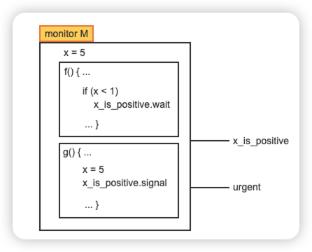

:::tip[Details]
A conditional variable can take any integer value.(**False**) Conditional variables are not traditional variables with values but only names of queues on which a process can await a condition to become true. 上图中的条件变量为x_is_positive
:::

### A monitor implementation of the bounded-buffer problem

管程天生保证互斥。这意味着 deposit（存入）和 remove（取出）这两个函数自动变成了临界区（Critical Sections）。无论外面有多少个生产者和消费者在疯狂调用这两个函数，管程的“智能保安”都会确保同一时刻，这个大方框里只有一个进程在执行代码。

两个条件变量：

- notfull（缓冲区未满）：这是生产者专属的休息室。如果缓冲区塞满了（full_slots == n），生产者就去这里睡觉（.wait）。

- notempty（缓冲区非空）：这是消费者专属的休息室。如果缓冲区空了（full_slots == 0），消费者就去这里睡觉（.wait）。


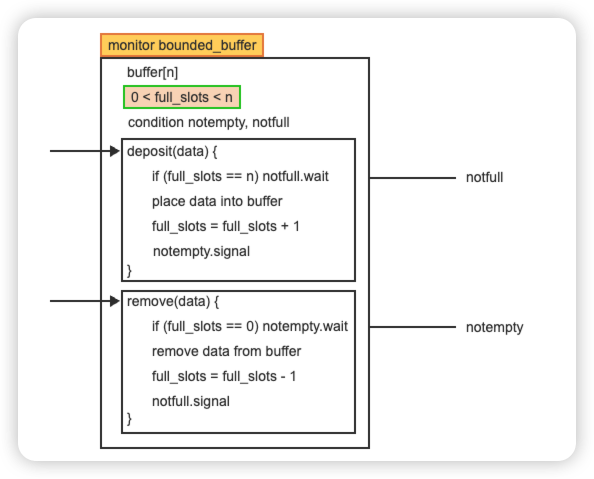

### Monitors with priority waits

Normally a queue associated with a conditional variable is processed in FIFO order. Some applications require additional control over the order of process reactivation.

A priority wait has the form **c.wait(p)**, where c is a conditional variable and p is an integer specifying a priority according to which processes blocked on c are reactivated.

### Implementation of a monitor

为了把管程翻译成信号量，编译器隐式地定义了三个关键的信号量和两个计数器：

- mutex (初始为 1)：管程大门的主互斥锁。保证同一时刻只有一个人能在管程里。
- c (初始为 0)：对应图中的 notempty 或 notfull，是条件变量的专属休息室。
- c_cnt：记录专属休息室里睡了多少人。
- urg (初始为 0, Urgent 紧急队列)：【核心机制】 这是给发出 signal 信号的人准备的临时退避室！
- urg_cnt：记录紧急队列里有多少人

The compiler then replaces each function body and all wait and signal operations with the corresponding segment of code:
```c title="Function body"
P(mutex)
function body
if (urg_cnt > 0) V(urg)
   else V(mutex)
```
```c title="c.wait"
c_cnt = c_cnt + 1
if (urg_cnt > 0) V(urg)
   else V(mutex)
P(c)
c_cnt = c_cnt - 1
```
```c title="c.signal"
if (c_cnt > 0)
   urg_cnt = urg_cnt + 1
   V(c)
   P(urg)
   urg_cnt = urg_cnt - 1
```

在目前这种被称为 Hoare 语义 的管程模型中，有一个铁律：当进程 A 发出 signal 唤醒进程 B 时，B 必须立刻、马上执行！ 但是管程里只能有一个人，A 唤醒了 B，A 自己去哪？答案是：A 必须立刻让出位置，委屈自己退到 urg（紧急队列） 里去挂起排队，等 B 执行完了，A 才能回来继续执行。
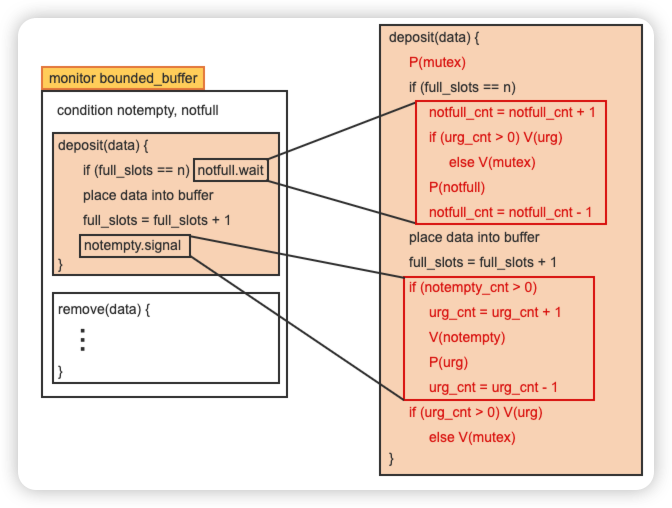

## The readers-writers problem

在实际的软件系统中（比如数据库），进程对数据的访问分为两种：
- Reader（读者）：只读取数据，不修改。
- Writer（写者）：会修改数据。

这带来了一个全新的特性：读操作是可以共享的（并发），但写操作必须是排他的（互斥），只要有人在写，别人既不能读，也不能写。

The main challenge is to guarantee maximum concurrency of readers while preventing the starvation of either type of process. Specifically, two rules must be enforced:
- A reader is permitted to join other readers currently in the CS only when no writer is waiting. When the last readers exits the CS, the writer is allowed to enter.
    - 就算阅览室里现在全是读者（可以并发），但只要门外有一个写者在排队，新来的读者就绝对不准“插队”进去，必须老老实实去写者后面排队。这就斩断了“源源不断的读者霸占阅览室”的可能。
- All readers that have arrived while a writer is in the CS must be allowed to enter before the next writer.
    - 当一个写者在里面独占写数据时，门外可能会积攒一批新来的读者和写者。当这个写者写完出来时，必须把刚才攒在门外的那批读者“打包”全部放进去读（批量放行），然后才能轮到下一个写者。这就防止了写者连续接力霸占阅览室。

规则2的演绎：
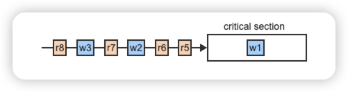
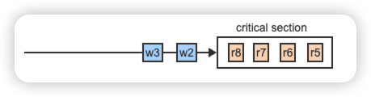

<details>
<summary>例题</summary>
While r1 is in the CS, the following processes arrive: r2, w1, w2, r3, r4. The processes will enter the CS in the order:

**Answer**: r1, r2, w1 , r3, r4, w2

</details>

### A monitor solution to the readers-writers problem

The monitor provides 4 functions:
- start_read is called by a reader to get a permission to read
- end_read is called by a reader when finished reading
- start_write is called by a writer to get a permission to write
- end_write is called by a writer when finished writing

Two counters, reading and writing, are used to keep track of the number of readers and the number of writers currently in CS, respectively 正在CS中读/写的进程数量

两个条件变量ok_to_read, ok_to_write表示正在排队的reader和writer队列，并且count(c)表示条件变量c对应的等待队列中的进程数量

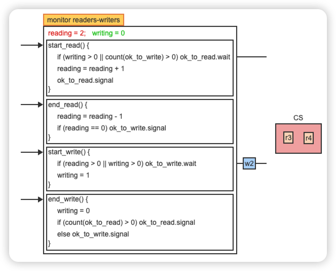

:::tip[链式唤醒]
在`start_read()`中最后一行：
当一个读者成功获准进入临界区后，他顺手去拉一把排在读者队列里的下一个人。下一个人醒来进入后，再拉下下个人……这就形成了“多米诺骨牌式的链式唤醒”，极其优雅地把积攒的读者全放进去了！并且代码中`if (writing > 0 || count(ok_to_write) > 0) ok_to_read.wait`是if而不是while，因为当读者醒来时，它确信条件一定满足（写者刚走），所以用 if 查一次就够了
:::

## The dining-philosophers problem 哲学家就餐问题

Five "philosophers", each representing a concurrent process, are seated around a table. Five "forks", each representing a resource, are placed on the table such that each two neighboring philosophers share one fork. Each philosopher alternates asynchronously between a phase of "thinking", which represents execution not requiring any shared resources, and "eating", which requires the prior acquisition of the two forks adjacent to the philosopher and shared with the two respective neighbors.

两个挑战：1、防止死锁；2、保证最大并发，即任意两个不相邻的哲学家可以同时用餐

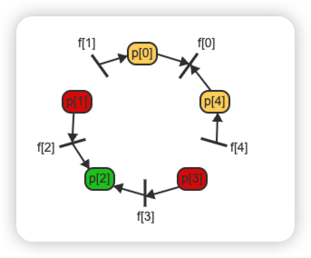

### Approaches to preventing deadlock

每个哲学家 p[i] 的行为可以表示为一个循环，该循环在思考和进食阶段之间交替。进食前，p[i] 会请求相邻的两把叉子，并在进食完毕后归还叉子。这两把叉子可以用 5 个信号量 f[0] 到 f[4] 表示，所有信号量初始值均为 1。P(f[i]) 对应于拿起叉子 f[i]，而V(f[i])对应于放下叉子 f[i]。

```c title="Deadlock"
p(i) {
   while (1) {
        think
        P(f[i])
        P(f[i+1 mod 5])
        eat
        V(f[i])
        V(f[i+1 mod 5])
   }
}
```
这段代码会导致死锁，因为所有哲学家都可以同时拿起左边的叉子 f[i]，然后在拿起右边的叉子时无限期地阻塞。有几种方法可以避免这个问题：
- Approach 1: Request both forks at the same time in a critical section.
    - 即每次只能有一个人去拿叉子。代码逻辑：在 P(f[i]) 之前加了一把大锁 P(mutex)，拿到叉子后再释放 V(mutex)。
    - 致命缺陷（性能极差）：虽然没有死锁，但并发性被严重破坏了。假设 $p[0]$ 拿了叉子在吃，此时 $p[1]$ 走进了取餐区，发现少一把叉子，他就被阻塞。这会导致本来有闲置叉子可以吃饭的 $p[2]$ 和 $p[3]$，连取餐区的门都进不去！
- Approach 2: One philosopher picks up the forks in the opposite order from all other philosophers. 一位哲学家拿起叉子的顺序与其他所有哲学家相反
    - 代码逻辑
    ```c
    P(f[min(i, i+1 mod 5)]) // 先拿编号较小的叉子
    P(f[max(i, i+1 mod 5)]) // 再拿编号较大的叉子
    ```
    - 前 4 个哲学家（$p[0]$ 到 $p[3]$）的逻辑没变：比如 $p[2]$ 身边是 2号和3号叉子，min 是 2，所以他先拿左手的 2 号。但是，对于 $p[4]$ 哲学家,$p[4]$ 身边是 4号和0号叉子。根据公式，min 是 0，max 是 4。它会先拿$f[0]$，一次在第一轮拿叉子的时候，$p[0]$和$p[4]$会竞争$f[0]$, 任何一个人胜利，都会阻塞另一个人，从而有一个哲学家能在第二轮拿到两个叉子。

### A monitor solution to the dining philosophers problem

核心的思维转变：忘掉叉子

在这个管程模型中，我们不再用代码去模拟“拿起左叉子”、“拿起右叉子”这种细碎的动作。管程只关心一件事：哲学家当前的状态（State）。

- state[5]：记录 5 个哲学家的状态。每个人只能是三种状态之一：thinking（思考）、hungry（饿了想吃，但可能在等）、eating（正在吃）。
- condition eat[5]：这是 5 个条件变量。你可以把它想象成 5 个单人专属休息室。如果哲学家 $i$ 饿了但吃不上，他就去自己专属的 eat[i] 休息室睡觉，绝不干扰别人。

:::note[test(i)函数]
用来裁决哲学家 $i$ 到底能不能吃饭。必须同时满足三个条件：
- 左边的邻居没在吃：state[i-1] != eating
- 我自己确实饿了：state[i] == hungry
- 右边的邻居没在吃：state[i+1] != eating
如果三个条件全满足，裁判宣布：你可以吃了（state[i] = eating），并顺手发个信号 eat[i].signal（如果他在睡觉就叫醒他，如果没睡这个信号也没副作用）。
:::
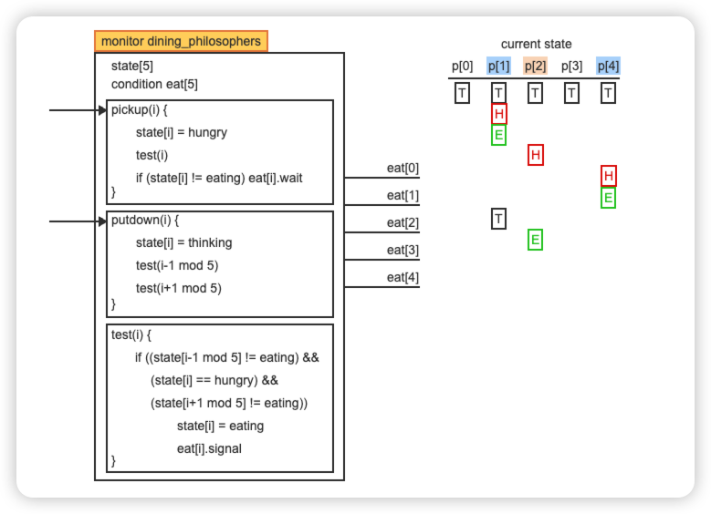

## The elevator algorithm

问题引入：存储磁盘由 n 个同心磁道组成，读写请求需要按某种未指定的顺序依次访问这些磁道。目标是在防止数据饥饿的同时，尽可能缩短磁道间的传输距离。

:::note[elevator algorithm]
电梯算法的逻辑极其符合我们生活中的常识：
- 电梯保持一个运动方向（比如一直向上）。
- 只要上方还有人按了楼层，它就一直往上开，顺路把遇到的人都带上。
- 直到上方彻底没请求了，它才掉头，开始向下运行，顺路处理向下的请求。
这种方式完美地把物理移动距离降到了最低，而且绝对不会有人被饿死（因为电梯总会掉头）。
:::

两个条件变量（方向队列）：
- upsweep：专门存放目标楼层在当前上方的请求。
- downsweep：专门存放目标楼层在当前下方的请求。

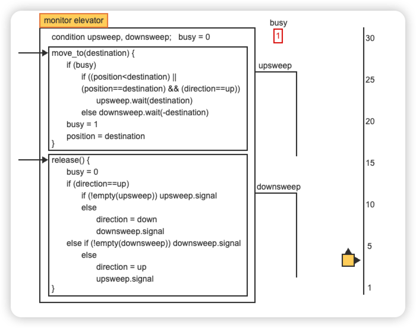

```c title="read disk"
// 任何一个想要读取磁盘的进程，它的完整业务代码：
void read_disk_data(int destination) {

    // 第一步：向管程申请通行证（如果没轮到我，就会在这里 wait 沉睡）
    elevator.move_to(destination);

    // ==========================================
    // 第二步：此时成功从 move_to 醒来并退出，说明轮到我了！
    // 控制真实的物理磁头移动到 destination，并读取数据。
    // （这个过程极其耗时，且完全在管程外部执行）
    perform_physical_io();
    // ==========================================

    // 第三步：我读完数据了！通知管程我用完了，叫下一个人。
    elevator.release();
}
```
